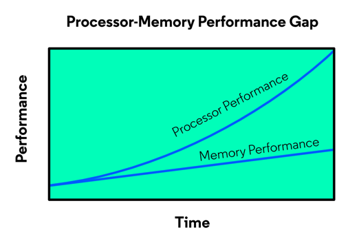
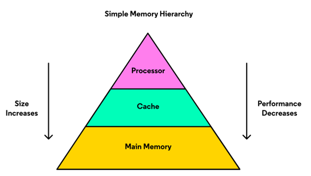
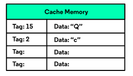
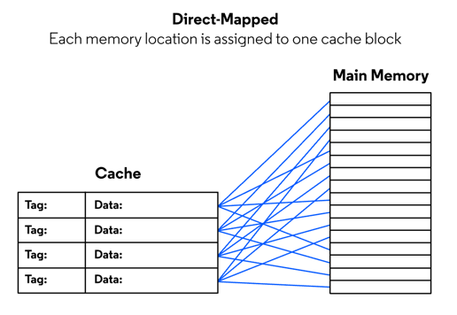
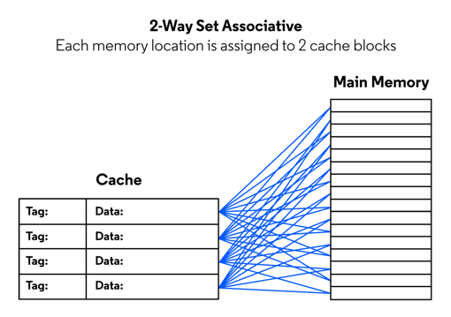

# Cache

## Memory Hierarchy

Year after year, processor performance increases at a much higher rate than that of memory. This is the processor-memory performance gap and results in a computer that can process data much faster than it can retrieve data from memory.

In the gardening example from the previous exercise, you needed to get fertilizer from the store. The garden is equivalent to the processor and retrieving the fertilizer from the store is the same as retrieving data from the main memory.

The image above represents a simple memory hierarchy. At the top is the processor with the best performance. But it can only hold a small amount of data. At the bottom is memory with decreased performance but increased size for data. This memory is the DDR memory used widely in computers today and throughout this lesson, it will be called the main memory.

The middle section of the memory hierarchy is the cache and is equivalent to your storage shed in the gardening example. The shed is where the extra fertilizer is stored for later use. Cache memory is similar in that it stores data for faster access times to help bridge the processor-memory performance gap.

## Cache Memory

 Cache memory can hold more data than the processor but less than main 
  memory. Its size means data retrieval is slower than that within the 
  processor but is faster than that from main memory.

 Cache memory performance and size is a compromise between the processor 
  and main memory, but these aren’t the only characteristics of the cache 
  that help bridge the performance gap. The structure and behavior of the 
 cache are what lead to quicker data retrieval.

 The cache is made up of blocks and each one stores a copy of data from 
  the main memory. When a piece of data is stored in the cache, it is 
  paired with a _tag_ which is equal to the address of the data in the main 
  memory. This simplifies retrieval since the processor uses the same 
  address when accessing data from the cache and main memory. A tag and 
 data pair in a block of cache is called an `entry`.
 

The diagram above represents a small cache with 4 blocks. The cache has two entries from the main memory: the character "Q" with a tag 15 and the character "c" with a tag 2. Remember the tag is the main memory address of the data and is what is used to indicate if the requested data is located in the cache.

## Cache Hit

When the data requested from the processor is in the cache, a _cache hit_ occurs:

The processor requests the data located at the main memory address 2. The address is found inside the cache so a cache hit occurs. The character "c" will be returned from the cache and the main memory is never accessed.

**The goal of the memory hierarchy** is to reduce data access time by getting as many cache hits when requesting data from memory.

## Cache MIss

When the data requested from the processor is NOT in the cache, a _cache 
miss_ occurs. 

 The data request first goes to the cache. When the data is not found in 
  the cache, a cache miss occurs and the request goes to the main memory. 
  The memory address and retrieved data will then be placed in the cache. 
  Finally, the processor will finish the request by retrieving the data 
 from the cache.

 While a cache miss helps put the needed data in the cache, the goal of 
  the cache is to limit the cache misses.
 
## Replacement Policy

 What happens when the cache is full and a cache miss occurs? The incoming 
  data will need to replace an existing entry in the cache. But, which entry?

 The decision about which populated entry will be replaced with new data 
  is made by the cache’s `replacement policy`. This decision might be random 
  or it might use information about the cache entries. When choosing a 
  replacement policy for an architecture, designers look at how to improve 
  performance while keeping the design simple.

### FIFO (First In First Out)

 This policy replaces the entries in the order that they came into the 
  cache. An index is maintained by the cache that points to the next entry 
  to be replaced. After replacement, the index is incremented or set back 
 to the first entry if the last entry was just replaced.

### LRU (Least Recently Used)

 This policy replaces the entry with the most time passed since it was 
  last accessed. This requires that each entry have a way to keep track of 
  when it was last accessed compared to the other entries. This 
  implementation is the most difficult to implement and the design may not 
  be worth the improved performance.

### Random Replacement

 This policy chooses a cache entry at random. It is easier to implement 
  than the FIFO and LRU policies.

 The correct replacement policy is key to increasing the number of cache 
  hits achieved by the processor. The random replacement policy is simple 
  to implement but might cause more cache misses than the other 2 policies.
  The LRU policy is more complicated but tends to do a better job at 
  keeping data in the cache that will be used again.

## Associativity

 Up until now, data from the main memory has been placed in any block of 
  the cache. What if each location in the main memory can be placed in 
  specific cache blocks? Associating memory locations to specified cache 
 blocks is called cache _associativity_.

There are three types of associativity:

### Fully Associative

Each location in the main memory can go to any block in the cache. 

### Direct Mapped

 This association is where every location in the main memory can only be 
  placed in one specified block in the cache. Direct-mapped associativity 
  does not require a replacement policy since there is only one cache 
 entry for each location in the main memory.

### n-Way Set Associative

 This cache associativity breaks the cache into sets of n blocks. Each 
  location in the main memory is mapped to a specified set of blocks. This 
  requires a replacement policy but one that only keeps track of n blocks 
  in each set. An 4 block cache with 2 blocks per set is called 2-way set 
  associative and has a total of 2 sets. Each location in the main memory 
  is mapped to a set of 2.

 Fully associative and direct-mapped cache are types of set-associative 
  caches. A fully associative cache with 32 blocks is considered to be a 
  32-way set associated with one set. A direct-mapped cache with 32 blocks 
 is considered to be a 1-way set associated with 32 sets.

## Write Policy

 When the processor writes data to memory it is always written to cache. 
  Just like a cache read, the memory address is searched within the tags 
  of the cache entries. During a write, if the address is found the data 
  is overwritten in the cache. If it is not found the replacement policy 
  is used to decide which entry will be replaced with the entry.

 The decision of when to send data to the main memory is made by the cache 
 `write policy`. Here are two common write policies:

### Write-Through

Writes the data to the main memory at the same time it is written to cache. 

 This policy is easy to implement since there are no decisions that need 
  to be made after the data is written to cache. 
 
 The downside is that every write will require a main memory access which 
 is slower and sometimes unnecessary.

### Write-Back
 
Only writes the data to the main memory when the memory address in the 
 associated cache entry is overwritten. _This policy is more complicated to 
implement because the data in cache now has to be monitored._

 The benefit of the write-back policy is that every write does not access 
  the main memory. It is possible for the processor to put data in the 
  cache, access it multiple times, and not need it anymore without ever 
  having to write it to the main memory. When using the write-back policy, 
 this saves time over many write cycles.