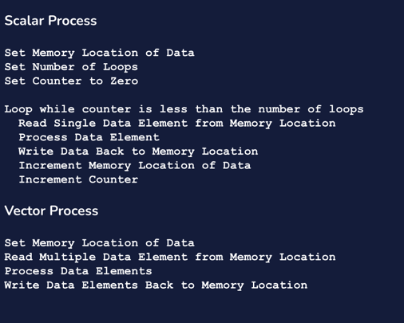
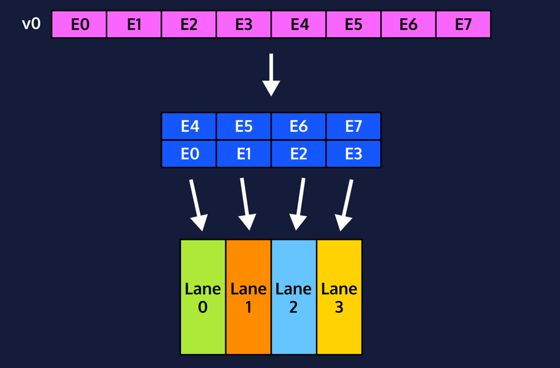

# Data Level Parallelism (DLP) 

## SIMD (Single Instruction , Multiple Data)

If the same function is to be applied to each data element, one instruction can be called to act on all the elements. SIMD is one approach to data-level parallelism and is almost as old as the modern computer era.

The different applications of SIMD are:

- Vector Processing
- SIMD Extensions
- Graphical Processing Units (GPUs)

 If you are going to be doing the same thing multiple times why not pool resources and do them all at once.
 


---

### Vector Processing

 Vector processing was conceived in the 1960s and is one of the earliest 
  applications of SIMD computing. Instead of processing one value at a 
  time using a single instruction, researchers were looking for ways to 
  use a single instruction to process multiple related values, known as 
  vectors. The Cray-1 supercomputer is said to be one of the first 
 supercomputers to successfully implement vector processing.


 The scalar approach is split into 2 parts: setting up and looping. The 
  setup section loads the memory location of the data, sets a counter and 
  defines the number of loops. The loop section retrieves the data, 
  processes it, and writes the data back to memory. The counter and memory 
  location both get incremented and the loop goes back to the beginning.

 The vector approach is much smaller at 4 lines. The memory location of 
  the data is set just the same as in the scalar approach. When retrieving 
  the data a vector of elements is retrieved. There’s one instruction to 
  process all the elements and then another to write them all back to memory.



 The difference in the number of instructions is noticeable and would be 
  more so if we wrote out all the instructions executed after the looping 
  was complete. This results in a lot of time and energy saved by the 
  processor.


 The following are mechanisms that leverage the properties of vector 
 processing to benefit performance:

#### Less Instruction Overhead
With one instruction per vector, there will be far fewer fetch and decode stages per data. After the initial overhead of a single instruction fetch and decode, multiple data elements can go through the pipeline using the rest of the stages.

#### Memory Access Bandwidth
It is not only instructions that can be pipelined, but also memory accesses. When an instruction begins, a certain amount of data is retrieved from memory. When data is moved to the next stage in the pipeline the next set of data can be retrieved from memory. This overlapping of memory accesses reduces the overhead involved in accessing such large amounts of data from memory.

#### Pipelining
A vector processor utilizes the Fetch, Decode, Execute, Memory Access and Write Back instruction process and therefore can leverage pipelining to increase the throughput of data.

---

### Vector Architecture

#### Vector Registers
 To operate on large amounts of data, the CPU will need somewhere to put 
  it. Vector registers are just like regular single element registers 
  except they can hold multiple elements of data. The Cray-1 worked on 
  64-bit data and each vector register could hold up to 64 elements of 
  data. This is a register that is: 64 x 64 = 4096 bits long!

```text
<register_size> / <data length> = # of elements the vector register can hold.

EXAMPLE: 
 1024 bit register, 64-bit data length 
 
 1024/64 = 512/32 = 256/16 = 128/8 = 64/4 = 32/2 = 16 elements
```

#### Internal Looping
 A code loop is how a scalar processor performs the same operation on 
  multiple points of data. While there are mechanisms to simplify coded 
  loops, there will always be multiple instruction fetches and decodes per 
  loop. Since a vector architecture commonly performs the same operation 
  on vectors of data, the looping is assumed and can be built into the 
 architecture without any extra instruction fetches.

#### Lanes
 Vector architectures can also use multiple lanes to process data elements 
  simultaneously. Each lane can hold all the functional units a scalar 
  processor has such as arithmetic, floating-point, and logic units. This 
  comes at the cost of a more complex architecture, but they can help 
  speed up processing drastically.

 Vector processors also contain much of the same hardware that scalar 
  processors do. One example is scalar registers to hold immediate values. 
  If a program needs to add 5 to an entire vector register, it makes sense 
 to hold the value 5 in a scalar register and not one element of a vector register.

---

## SIMD Extensions

 Processors used for personal and business computers started out as scalar 
  processors where the registers and functional units were meant for 
  single elements of data. Because of higher demand, data multimedia 
  applications like processor manufacturers looked at ways they could 
  leverage the benefits of vector processing.

 The result was a new processor design that maintains the scalar 
  functionality but added components of vector processors. These additions 
  are known as `SIMD Extensions.`

 Every major processor company has some form of SIMD extension. As 
  data-intensive tasks have become more mainstream the need to improve the 
  performance of the extensions grew.

 The x86 instruction set architecture introduced SIMD extensions in the 
  late 1990s with `Streaming SIMD Extensions (SSE)`. The architecture added 
  instructions that worked on 8 registers labeled xmm0 - xmm7. These 
 registers were 128 bits long and could hold up to four 32-bit floating point values.

 Over the years these SIMD Extensions were updated with more instructions 
  and include zmm registers that are up to 512-bits long. These additional 
  capabilities have been essential to keeping up with the increasing 
  amount of data used by commonly used applications.

---

## Graphical Processing Units (GPUs)

 As long as there was a need for visual output on a computer, Graphical 
  Processing Units (GPUs) existed. They provide the specific function of 
  handling all the information to be output to the user as graphics.

Today’s graphical applications are demanding. GPUs are used for a variety 
of applications including video games and video processing applications. 
GPUs also perform well with many non-graphical applications like digital 
 signal processing, machine learning applications, and cryptocurrency.

 GPUs are separate architectures from CPUs and are used to take on more 
  graphic-intensive jobs. Some CPUs come with GPUs included in their chip, 
  while other CPUs require a GPU to be added as an external piece of hardware.

 GPUs are SIMD architectures that focus on efficiently processing 
  graphical data. Because of this, they differ from standard scalar and 
 vector CPUs in the following ways:

- Operations on graphical data tend to be simple but at a very large scale 
so today’s GPUs have simpler functional units but a lot of them.
- GPU clock speeds lag way behind standard CPUs
- While processing branches, in general, is a challenge, GPUs are 
especially inefficient with applications involving branching.
 
Because of higher demand applications, GPU companies have evolved their 
 architectures to address the specific nature of their workload: simple 
 operations on a lot of data. To accomplish this the _**Single Instruction 
Multiple Thread (SIMT)**_ architecture was created.

SIMT operates on data that needs simple processing. A single operation 
 can be sent to many small processing units called threads. These threads synchronously process data in bulk. As design capabilities get better GPUs can handle more threads and therefore process more data.