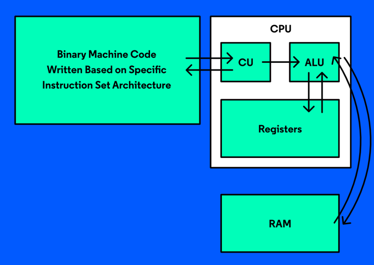
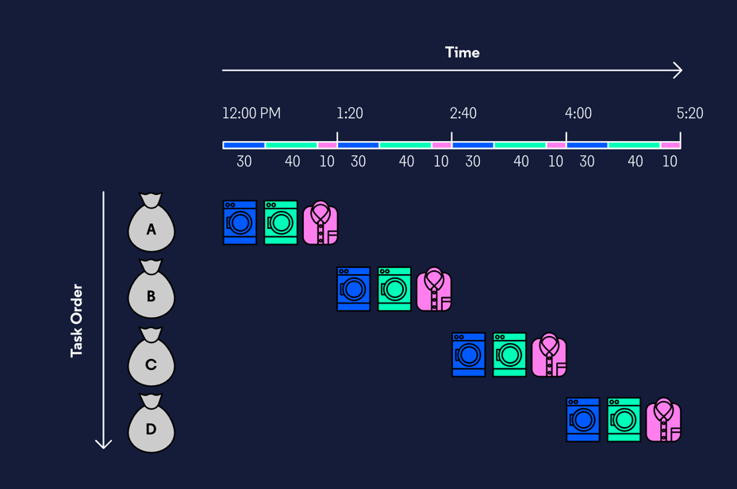
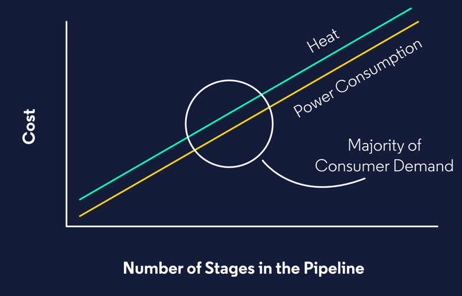
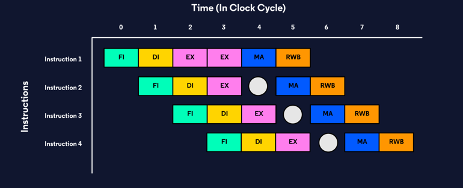

# The Instruction Cycle

In order for a single instruction to be executed by the CPU, it must go through the instruction cycle (also sometimes referred to as the fetch-execute cycle). While this cycle can vary from CPU to CPU, they typically consist of the following stages:

- Fetch
- Decode
- Execute
- Memory Access
- Registry Write-Back

## Executing the Instruction
In this stage, the instruction is performed! We noted that during the decoding stage, the instruction is decoded into control signals and sent to the correct part of the ALU to be processed and completed.

In our deli example, this is the part where the order gets made!

To process an instruction, we need to 
- fetch it from memory, 
- decode the instruction, 
- and execute it. 

Sometimes a few extra stages need to occur before or after execution.

## Memory Access
 The memory access stage is used to retrieve any required data necessary 
  to execute an instruction. _This stage only occurs if the instruction 
 requires data from memory_. 
 
For example, imagine the following Python code:

```python
x = 5
y = x + 3
```

 Once the first instruction is complete, a piece of memory is created to 
  store the data x = 5. The second instruction, y = x + 3, is a little 
  trickier to execute because the value of y relies on whatever value was 
  assigned to x. Before y = x + 3 can be executed, we need to access the 
  memory address of the first instruction x = 5 in order to retrieve the 
 data that tells us what the value of x is.

 Imagine in your deli order, you ask for honey mustard to be added to one 
  of the two sandwiches you order. Before your order can be created, the 
 staff member needs to make and retrieve honey mustard for the sandwich.

## Registry Write-Back
 The registry write-back stage is used if the execution of the instruction 
 impacts data. This is another stage that isn’t always a part of the cycle.

Let’s think back to our previous example:

```python
x = 5
y = x + 3
```

 As each instruction is executed, we find ourselves needing to save this 
  data. During the registry write-back stage, this new data is stored to 
  one of the register’s in the CPU. The registry write-back stage is also 
  necessary if existing data is changed or updated.

 As the deli’s 10,000th customer, they decide to name your order after you 
  and put it on their “Deli Specials” board. They need to create space and 
  allocate a part of the board’s “memory” to store your order.

---

# Instruction Pipelining



## Problems w/ Linear/Sequential Processing

Imagine it’s laundry day. Let’s assume it takes the following times to 
complete each laundry task:

- 30 minutes: Washing machine cycle
- 40 minutes: Dryer
- 10 minutes: Fold and put away
If we were to do each of these steps and waited for each step to be completed before starting the next, our total time would be 80 minutes (30 wash + 40 dry + 10 fold). If we started washing a single load of laundry at noon, we would be finished at 1:20 pm.

An hour and twenty minutes doesn’t seem too bad, but what if we had to complete multiple loads of laundry without overlapping any tasks? If we had four loads of laundry, it would take us 320 minutes (80 *4) to complete. If we started this task at noon, we wouldn’t be finished with your wash until 5:20 pm. There went our entire afternoon.

## Linear Instructions

- Fetch Instruction
- Decode Instruction
- Execute
- Memory Access
- Registry Write Back

 The goal is that each step would take one cycle. This is not always the 
  case because some instructions take longer and there are more steps than 
  this in a modern CPU, but one step per cycle is the ideal situation. If 
  the system ran one instruction after another sequentially, each 
  instruction would take five cycles to complete; if we had four 
  instructions to process (a crazy simple request for a CPU), it would 
  take a total of 20 cycles.
 


## Pipelining

 `Pipelining` is a processing technique that efficiently maximizes the 
  throughput of multiple computer instructions by processing the 
  instructions in overlapping phases.

Let’s reexamine the instruction processing cycle:

- Fetch Instruction
- Decode Instruction
- Execute
- Memory Access
- Registry Write Back

We talked about how a processor could go through these one at a time for 
 each instruction before starting to process the next. Systems do not do 
 this; instead, they pipeline the instructions much like our laundry example.

 When instruction 1 finishes the fetch stage and moves onto the decode 
  step, the CPU starts the fetch stage with instruction 2. In the third 
  cycle, when instruction 1 is on the execute stage and instruction 2 is 
  on the decode stage, instruction 3 is in the fetch stage.

 If four instructions were to be processed with pipelining, it would 
  complete in 8 cycles - a significant difference over our original 20.
 


Pipelining is part of the hardware and can’t be turned off. All of the logic for how the processor handles instructions in a pipeline is built into the hardware.

Nothing is free, and this is true for processor pipelines as well. The increase in the complexity of the hardware comes at the cost of the processer running hotter and using more power. This also causes an increase in the cost to manufacture.

The entire goal of pipelining is to get many instructions completed as quickly as possible. Pipelining does nothing to improve the speed of an individual instruction. The power of pipelining shows when there are many instructions that need processing.

The theoretical improvement of a pipeline is proportional to the number of stages in the pipeline. In our overview of pipeline and laundry, we keep our number of steps to just a few for clarity; however, many CPUs have 7, 10, 20, or even more than 30 stages in their pipeline.

Up to 30 stages? But I thought before we were told that there are five stages in the pipeline? The five stages we examined earlier in this lesson can be thought of as general groupings of stages of the pipeline. These stages can be broken down even further into more individual steps.




---

# Hazards

## Structural Hazards

A limitation of the hardware itself. There are some limitations such as not 
being able to fetch an instruction and decode it in the same stage. The memory access is another limitation. The information the CPU needs to process is in cache instead of RAM because of the speed difference, but not everything that is needed can fit on cache so there will be times where the cache needs to work with RAM, and this costs time. ALU (arithmetic logic units) can only process one instruction at a time, and some instructions can be more demanding than others, such as division.

Poor hardware design, specifically poor design for the specific needs of the software being run on the hardware, can cause unnecessary structural hazards.

## Data Hazards

occurs when an instruction is dependent on another instruction still in the pipeline.

For example, in order to process instruction_2 in the following code example, we must get the results from instruction_1 first:

```python
# instruction_2 relies on the result of instruction_1
instruction_1 = x / y
instruction_2 = instruction_1 + a
```

## Control Hazards

 if statements, loops, and branches; these are the things that make up 
  control hazards because they cause situations where the system doesn’t 
  know for certain which set of instructions will need to be processed. 
  Analysis shows that these occur anywhere between every 5th and 8th 
  instruction in a pipeline, so these are a very common issue, especially 
  if the system takes the wrong branch and has to restart from the other path.

 The fundamental issue with control hazards is that the processor does not 
  know if it needs to run the code inside the if/branch/loop statement 
  until it processes the conditional. If the processor guesses wrong on 
  what way the conditional will go, it will have to flush the pipeline and 
  take the branch or skip the instruction depending on which way the 
  processor guessed.

 An example of when there could be a control hazard might look something 
 like this:
 
```python
def do_something(a, b):
  x = a + b
  y = a * b
  if (x > y):
    x = x + y
  y = y + x
  # ...
```

 The code x = x + y may or may not need to be processed depending on the 
  outcome of the condition statement if (x > y):. Notice that the next 
  line of code after the block, y = y + x is dependent on the information 
  in the code block, but only if the code block is executed, creating a 
 data hazard as well.
 

## Reducing Data Hazards

 Since data hazards occur when one instruction is dependent on another, 
  there are a few ways that hardware designers can create the chips to try 
  and limit these issues. Pipelining is a hardware issue and not a 
  software issue, but bad code will only make it harder for the hardware 
 to deal with hazards.

 - `Passing Instructions `One method is to _**have the hardware setup to 
be able to pass results from one instruction to another within the pipeline**_, 
reducing the read/writebacks to memory that are needed.

 - `Reordering Instructions ` Another tactic is for the system to **_reorder 
the sequence of the 
  instructions_**. By doing this, the number of instructions in the pipeline 
  that are dependent on one another is reduced. This can get more complex 
  as it would require the processor to read ahead of the instructions to 
  know which are dependent on each other and which can be processed out of 
  sequence as they were created. If done correctly, this can allow for the 
  pipeline to finish one instruction that has another dependent on it 
  before another enters the pipeline but still processing others at the 
 same time.
 - `Bubbling Instructions `The last major option is to _**create a bubble or 
stall in the pipeline**_. This involves holding the instructions until the information they need 
has been processed and then resuming the normal pipeline flow.



## Reducing Control Hazards

For control hazards in which conditional code segments, loops, or 
branches can cause issues, processors can take a few approaches.

- `Bubbling Instructions `Basic processors will do a long stall on the 
pipeline until the outcome of the branch is known. This is much like the bubble tactic sometimes 
 used to handle data hazards. In both cases, the system doesn’t know what 
 it should do or what value to use so it simply waits until it has this 
 information.

- Advanced processors use `branch prediction` where the compiler guesses 
 based on passed behavior which branch will be used and fills the pipeline 
 assuming this path will be taken. 
  - A downside to this method is that if 
   their guess is wrong then they have to do a pipeline flush, forcing them 
   to start over. 
  - Thankfully modern processors are quite good at this, so if 
   designed correctly, this method is actually quite useful. Think of it 
   like taking an umbrella out if you live in a wet area (Washington State, 
   Scotland, etc); it might not be raining when the day starts, but the odds 
   that you will need one before the day is over is high enough that you are 
   better off carrying one with you.
- Another way the compiler can deal with control hazards is to `inline 
  methods` to avoid calls to the method.
- `unrolling loops `For loops, the system can unroll them to not have to loop 
through but instead run them as a linear list of instructions as this is faster than 
  memory jumps.

---

