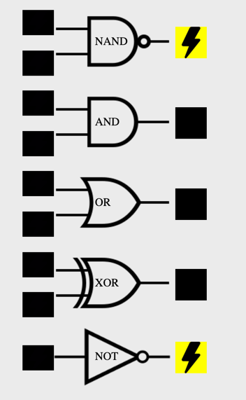

# Logic Gates




At the lowest level, computers run on electric currents limited to two states: power or no power.

There are many ways to represent the two states:

- “I have current!” vs. “I don’t have current!”
- “on” vs. “off”
- `+ vs. -`
- True vs. False
- 1 vs. 0

 We’ll use 1 and 0 for the remainder of the lesson. This piece of 
  information (power or no power) localized to a single location is called 
 a bit.

- Bit with power: 1
- Bit without power: 0

 Logic gates receive one or more inputs of current and alter the power 
 according to their rules.

Some logic gates will only output power if both of their inputs are powered:

## Truth Tables

Shows the output for all possible inputs for a given logic gate. 

### NAND

(0, 0) = 1 <br>
(0, 1) = 1 <br>
(1, 0) = 1 <br>
(1, 1) = 0 <br>

### AND

(0, 0) = 0 <br>
(0, 1) = 0 <br>
(1, 0) = 0 <br>
(1, 1) = 1 <br>

### OR

(0, 0) = 0 <br>
(0, 1) = 1 <br>
(1, 0) = 1 <br>
(1, 1) = 1 <br>

### XOR

(0, 0) = 0 <br>
(0, 1) = 1 <br>
(1, 0) = 1 <br>
(1, 1) = 0 <br>

### NOT

(0) = 1 <br>
(1) = 0 <br>


## Built in Operators for Logic Gates
```python
#NOT: 
~ x
#E.g. ~1 == 0 and ~0 == 1
 
#AND:
x & y
#E.g. 1&1 == 1 and 1&0 == 0
 
#OR:
x | y
#E.g. 1|1 == 1 and 0|0 == 0
 
#XOR:
x ^ y
#E.g. 1^1 == 0 and 1^0 == 1
```