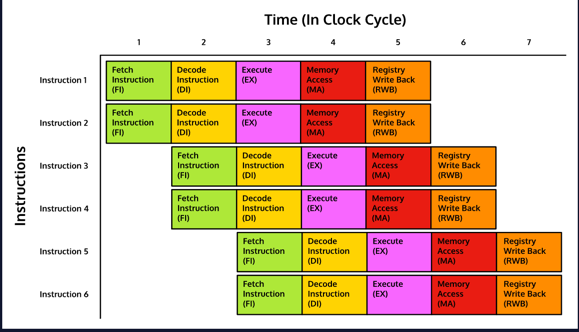
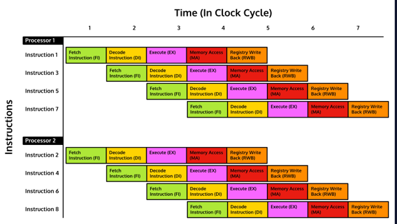

# Superscalar Architecture

 Processors that take advantage of superscalar architecture are designed 
  to use a methodology of parallelism where instructions are sent to 
  different execution units at the same time, allowing for more than one 
  instruction to be processed in a single clock cycle. In a superscalar 
  processor, each execution unit (such as an ALU) is within a single CPU. 
  The dispatcher reads instructions from memory to find the ones that can 
 be run in parallel, sending them to their own path if possible.

 By spreading the instructions across several instruction sets, it can 
  allow for specialization such as an ALU for integer math and another for 
  floating-point math. This can allow the dispatcher (controls where 
  instructions are sent to be processed) to send different instructions to 
  different ALUs for not only superscalar speed improvements of divide and 
 conquer but also improved processing speed from specialized components.

 Because the instruction sets are run on the same CPU it does allow for 
  sharing of resources such as registers allowing for results of one 
 instruction to be shared with another quicker.

 “Except for CPUs used in low-power applications, embedded systems, and 
  battery-powered devices, essentially all general-purpose CPUs developed 
 since about 1998 are superscalar.”
 

# Superscalar vs. Pipelining

 This sounds an awful lot like pipelining, doesn’t it? They are similar in 
  that they are both using the concept of parallelism; however, they are 
  implemented in different ways. 
 
Pipelining staggers instructions to run 
  through the same set of execution units so that each part is used by a 
  different instruction at the same time:
This contrasts with superscalar processing where instructions are spread 
  across different execution units so that two instructions can both be in 
  the same stage at the same time.

- Pipelining has multiple instructions simultaneously in different stages 
 of the process. 
- Superscalar has multiple instructions at the same stage on different 
execution units at the same time.

Most of the time you will find them working in concert together. 
 Instructions would be divided among different sets of execution units 
 (superscalar). Then each path would be staggered to allow each step to be 
 utilized in each cycle (pipelining). In fact, this is typically how a 
 superscalar CPU is set up; they are built to use both superscalar and 
pipeline strategies.



## Superscalar vs. Multiprocessor Units

 Superscalar processors are not the same thing as multi-core processors (a 
  processor on a single chip with two or more separate processing units) 
  because separate execution units are not the same thing as entire 
  processors. A superscalar can have multiple versions of the same 
  execution unit, such as integer shifter, float point arithmetic, 
  allowing for instructions to be parsed across the different parts inside 
  the same processor. In a multi-core processor, it can process 
  instructions in separate processors.



Just like how a chip can combine pipelining and superscalar, a chip can also use superscalar (or not) on each of its cores in a multicore chip.

## Hazards

### Structural Hazards
For instance, there are structural hazards, such as the delegation of instructions to the different execution units must be done correctly or pipeline stalls may occur when one instruction set is dependent on another. Poor assignments of instructions to execution units can also lead to some units going unused during a cycle, leading to less than optimum efficiency.

Instructions have to come out of the CPU in the right order even if they were ordered to be processed, this is because some instructions can take longer to process than others, such as float point arithmetic vs integer arithmetic.

Another structural hazard can occur with registry conflicts when two different instructions both need exclusive access to the same registry.

### Control Hazards
Control hazards are when a set of instructions is complicated by if statements, loops, and branches. These cause the processor to be unsure if the instructions will all need to be processed or if some can be skipped.

If there is a branch, the processor can execute both branches and throw away whichever is wrong; this is known as speculative execution. This can be combined with branch prediction to try and increase accuracy even more.

### Data Hazards
Superscaling makes data hazards even more complex than just pipelining. This is because instructions are in the same stage of the instruction process as others; if there are any dependencies, the instructions could be processed out of order.

For example, in order to process instruction_2 in the following code example, we must get the results from instruction_1 first:

```python
# instruction_2 relies on the result of instruction_1
instruction_1 = x / 2
instruction_2 = instruction_1 + 3
```

This example is very similar to the one we had for pipelining. The difference here is that because both instructions can run at the same time on different ALUs, instruction_2 could potentially finish processing before instruction_1 if the processer didn’t properly detect the instructions as data-dependent. instruction_2 could process faster because division is more intensive to execute than addition.

### Limitations
 Superscaling has several limitations which curb the number of possible 
  simulation processes. These limitations include:

- **The level of parallelism in the instruction set it is working with.** 
  - How dependent the instructions are on each other? 
  - How many loops are in the set?
- **The cost of dependency checking.** 
  - How much overhead is needed to go through the instruction set to look  
  for dependencies?
- **The branch instruction checking**. 
  - What is the cost of examining each of the branches?

 As processors become more and more advanced the number of ALUs can 
  improve, but this would simultaneously increase the burden on the 
  dependency checking and registry circuitry. “Collectively the power 
  consumption, complexity, and gate delay costs limit the achievable 
  superscalar speedup to roughly eight simultaneously dispatched 
 instructions.” 


