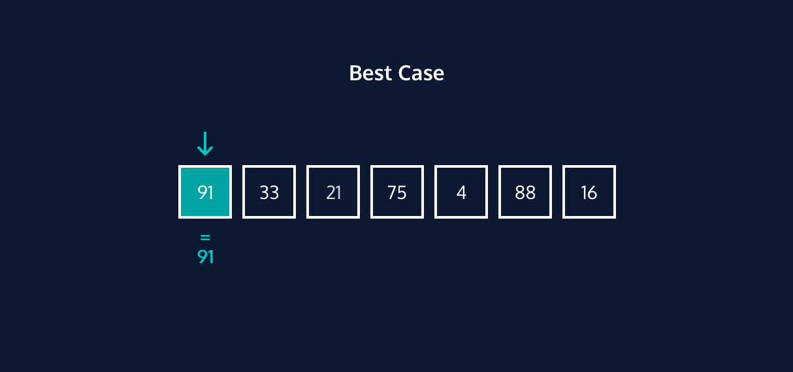
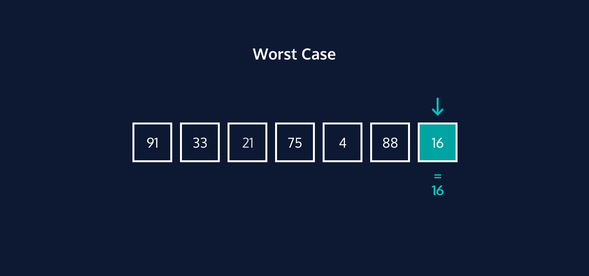
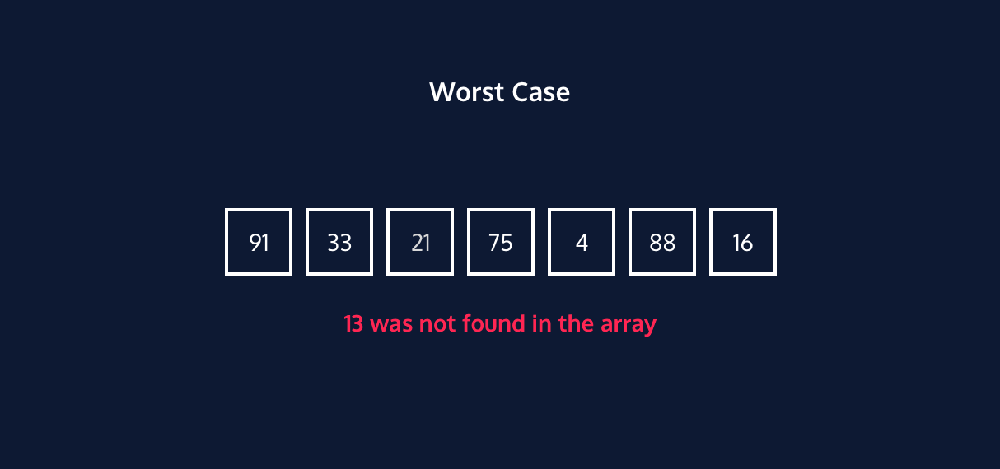
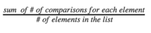
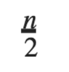

# Best Case Performance
Linear search is not considered the most efficient search algorithm, especially for lists of large magnitudes. However, linear search is a great choice if you expect to find the target value at the beginning of the list, or if you have a small list.

The best case performance for linear search occurs when the target value exists in the list and is in the first position of the list. In this case, the linear search algorithm will only be required to make one comparison. The time complexity for linear search in its best case is O(1).

# Worst Case Performance
There are two worst cases for linear search.

**Case 1**: when the target value at the end of the list.

**Case 2**: when the target value does not exist in the list.

In both cases, the linear search algorithm is required to scan the entire list of N elements and, therefore, makes N comparisons.

For this reason, the time complexity for linear search in its worst case is O(N).

# Average Case Performance
If this search was used 1000 times on 1000 different lists, some of them would be the best case, some the worst. For most searches, it would be somewhere in between.

On average it would be in the middle of the list, that search would take O(N/2) time. Let’s prove this.

Each element of the list on the right requires a different number of comparisons to be located in a list. Using linear search, the first element is located with one comparison, the second element is located with two comparisons, and so on until the last element is located in N, the size of the list, comparisons.

The average case performance is the average number of comparisons. To calculate this, you use this formula:

We won’t show the math, but we can simplify things by reducing the equation to:

We would expect on average for the linear search algorithm to search halfway through the list. Therefore the time complexity for linear search in its average case is O(N/2).

Based on Big O simplification rules, which you can learn about in the Big O lesson, we simplify the time complexity in this case to O(N).