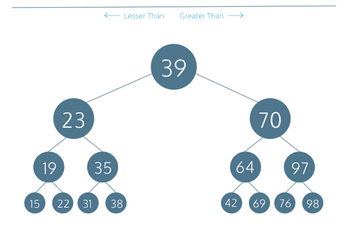

# Binary Search Tree 
an efficient data structure for fast `(O(log N)) `
 data storage and retrieval. It is a specialized tree data structure that 
 is made up of a root node, and at most two child branches, or subtrees.

 Depending on the requirements, a Binary Search Tree can have certain 
  qualities. It can allow duplicate values to exist, or enforce that there 
  are unique values only. If duplicate values are allowed, it must be 
  decided whether nodes with equal value go on the root’s left subtree or 
  right subtree.

 For this implementation, duplicate values will be allowed, and nodes with 
  values that are the same as the root node’s will be in the root node’s 
  right subtree.

 Each node will be an instance of the BinarySearchTree class and will have 
 the following properties:

- a value that represents the data stored
- a depth, where a depth of 1 indicates the top level, or root, of the tree 
  and a depth greater than 1 is a level somewhere lower in the tree
- a left instance variable that points to a left child which is itself a 
  Binary Search Tree, and must have a data lesser than its parent node’s data
- a right instance variable that points to a right child which is itself a 
  Binary Search Tree, and must have a data greater than or equal to its parent node’s data



---

## Insertion

If a new value < current (root) node's value, we insert it to the left
subtree:
- if a left child doesn't already exist, then we create a new 
  `BinarySearchTree` node w/ that value as the current node's child
- if it exists we call `.insert()` recursively on the current node's left 
  child to insert it appropriately further down the tree. 

 If a new value is not less than the current (root) node’s value, we’ll 
 want to insert it as a descendant on the right side. The logic for this will be similar:

- If a right child of the current node doesn’t already exist, we create a  
  new BinarySearchTree node with that value as this node’s right child.
- If a right child already exists, we would call .insert() recursively on 
  the current node’s right child.

```text
Insert 50
50 < 100, left child node doesn't exist, create a left child node with value 50 and depth 2

    ==> 100
       /
      50

Insert 125
125 > 100, right child node doesn't exist, create a right child node with value 125 and depth 2

    ==> 100
       /   \
      50    125

Insert 75
75 < 100, left child node with value 50 exists, recursively insert at left child

    ==> 100
       /   \
      50    125

75 > 50, right child node doesn't exist, create a right child node with value 75 and depth 3

        100
       /   \
  ==> 50    125
       \
       75

Insert 25
25 < 100, left child node with value 50 exists, recursively insert at left child

    ==> 100
       /   \
      50    125
        \
        75

25 < 50, left child node doesn't exist, create a left child node with value 25 and depth 3

        100
       /   \
  ==> 50    125
     /  \
    25  75
```

---

## Get Node By Value
```text
At the root node, 75 < 100 so we recursively search on the left child if it exists

    ==> 100
       /   \
      50    125
     /  \
    25  75

At node 50, 75 > 50 and there is a right child so we recursively search on the right child

        100
       /   \
  ==> 50    125
     /  \
    25  75

At the node 75, the value matches 75 so return this node

        100
       /   \
      50    125
     /  \
    25  75 <==
```

## Traversal

 With depth-first traversal, we always traverse down each left-side branch 
  of a tree fully before proceeding down the right branch. However, there 
 are three traversal options:

 <u>**Preorder**</u> is when we perform an action on the current node first, 
 followed 
 by its left child node and its right child node
 <u>**Inorder**</u> is when we perform an action on the left child node 
 first, 
 followed by the current node and the right child node
 <u>**Postorder**</u> is when we perform an action on the left child node 
 first, 
 followed by the right child node and then the current node

### Inorder Traversal

```text
           15
     /------+-----\
    12            20
   /   \         /   \   
 10     13     18     22
 / \   /  \    / \   /  \
8  11 12  14  16 19 21  25

    


```
We begin by traversing the left subtree at each level, which brings us to the
nodes with values 8, 10, and 11. The inorder traversal would be:

```8, 10, 11```

Ascend 1 level to visit root node `12` before descending back to bottom 
where the right subtree of `12, 13, 14` is. Inorder traversal continues w/

`12, 12, 13, 14`

Ascend one level up to visit root node `15` before we traverse the right 
subtree starting at the bottom sublevel again. Continue on to the 
bottom leftmost subtree where we have `16, 18, 19`. Inorder traversal 
continues:

`15, 16, 18, 19`

Ascende one level up to visit root node `20` before we descend back to the 
bottom where the rightmost subtree contains `21, 22, 25`, finishing the 
traversal with

`20, 21, 22, 25`

FINAL TRAVERSAL:

`8, 10, 11, 12, 12, 13, 14, 15, 16, 18, 19, 20, 21, 22, 25`