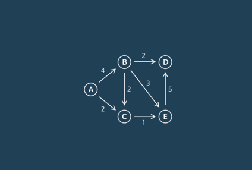
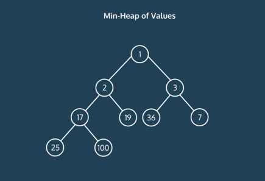
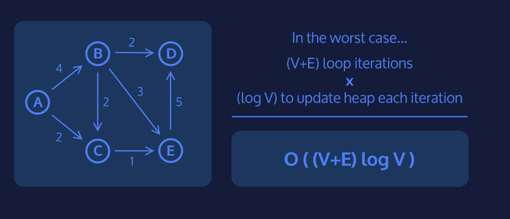

# Dijkstra's Algorithm


An algorithm that computes the shortest distance from a given vertex to 
the rest of a vertices in a graph. 


1. Instantiate a dictionary that will eventually map vertices to their 
distance from the start vertex
2. Assign the start vertex a distance of 0 in a min heap
3. Assign every other vertex a distance of infinity in a min heap
4. Remove the vertex with the smallest distance from the min heap and set  
that to the current vertex
5. For the current vertex, consider all of its adjacent vertices and 
calculate  the distance to them as **(distance to the current vertex) + 
(edge weight of current vertex to adjacent vertex).**
6. If this new distance is less than the current distance, replace the 
current distance.
7. Repeat 4 and 5 until the heap is empty
8. After the heap is empty, return the distances

## Conceptual Runtime

Efficiency can be broken into 2 parts: 
- Searching the graph
- Tracking the distances

 Just like breadth-first search and depth-first search, to search through 
  an entire graph, in the worst case, we would go through all of the edges 
 and all of the vertices resulting in a runtime of O(E + V).

 For Dijkstra’s, we use a min-heap to keep track of all the distances. 
  Searching through and updating a min-heap with V nodes takes O(log V) 
  because in each layer of the min-heap, we reduce the number of nodes we 
 are looking at by a factor of 2.
 


 In the worst case, we would update the min-heap every iteration. Since 
  there are at most E + V iterations of Dijkstra’s and it takes log V to 
  update a min-heap in the worst case, then the runtime of Dijkstra’s is O(
` (E+V)log V).`


---

## Understanding HeapQ

Remember that Dijkstra’s Algorithm works like the following:

- Instantiate a dictionary that will eventually map vertices to their 
distance from their start vertex
  - Assign the start vertex a distance of 0 in a min heap
  - Assign every other vertex a distance of infinity in a min heap
  - Remove the vertex with the smallest distance from the min heap and set 
  that to the current vertex
  - For the current vertex, consider all of it’s adjacent vertices and 
   calculate the distance to them by **(distance to the current vertex) + 
   (edge weight of current vertex to adjacent vertex)**. If this new 
   distance is less than its current distance, replace the distance.
  - Repeat 4 and 5 until the heap is empty
  - After the heap is empty, return the distances
  
 In order to keep track of all the distances for Dijkstra’s Algorithm, we 
  will be using a heap! Using a heap will allow removing the minimum from 
  the heap to be efficient. In python, there is a library called `heapq` 
 which we will use to do all of our dirty work for us!

 The `heapq` method has two critical methods we will use in Dijkstra’s 
 Algorithm: `heappush` and `heappop`.

- `heappush` will add a value to the heap and adjust the heap accordingly
- `heappop` will remove and return the smallest value from the heap

Let’s say we start by initializing a heap with the following tuple inside:

```python
heap = [(0, 'A')]
```

We can add values to this heap like this:

```python
heapq.heappush(heap, (1, 'B'))
heapq.heappush(heap, (-4, 'C'))
```

We can remove the smallest value in the heap like this:
```python
value, letter  = heapq.heappop(heap)
```

value will be equal to `-4`, and letter will be equal to `'C'`.