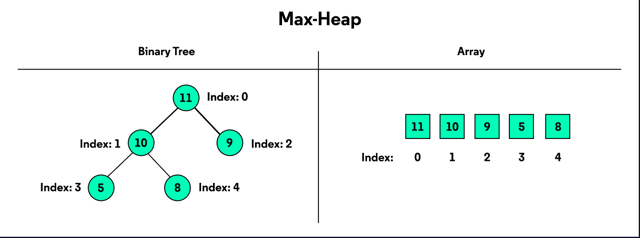

# Max Heaps

Heaps are used to maintain a max or min value in a dataset. 

## Intro to Heaps

Heaps solve the problem of always ensuring that the most 'important' thing 
is being done first. Generally, this problem is solved by using a special 
type of queue called a `priority queue`, which is often backed by a `heap` 
data structure. 

<u>**max-heap**</u>: heap that tracks maximum values  
<u>**min-heap**</u>: heap that tracks minimum values

Qualities:
- The root is the **maximum/minimum value** of the data set. 
- Every parent's value is **greater than** it's children. 

## Heap Representations. 

Can be viewed as a BST where each node has **at most** 2 children. 
As elements are added, they're added form the left until we've filled the 
entire level. 

**Note:** The examples in this article use numbers since this is a 
straightforward value, but heaps have many practical applications.

 At the top, we have our root value, `11`. Then, we’ve filled the next 
  level containing the root value’s children, `10` and `9`. The next addition 
  will be added as the left child of `10`, starting a new level in the tree. 
  We would continue filling this level from left to right until `9` had its 
  right child filled.

 Conceptually, the tree representation is beneficial for understanding. 
  Practically, we implement heaps in a sequential data structure like an 
  array or list for efficiency.

 Notice how by filling the tree from left to right; we’re leaving no gaps 
  in the array. The location of each child or parent derives from a 
 formula using the index.

- left child: `(index * 2) + 1`
- right child: `(index * 2) + 2`
- parent:` (index - 1) / 2` — not used on the root!

## Adding an Element

 Sometimes you will add an element to the heap that violates the heap’s 
 essential properties.

 We’re adding `18` as a left child of `2`, which violates the max-heap 
 property that parents must be larger or equal to their child.

 We need to restore the fundamental heap properties. This restoration is 
  known as **heapify** or **heapifying**. We’re adding an element to the 
 bottom  of the tree and moving upwards, so we’re **heapifying** up.

 As long as we’ve violated the heap properties, we’ll swap the offending 
  child with its parent until we restore the properties, or until there’s 
  no parent left. If there is no parent left, that element becomes the new 
 root of the tree.

 `18` swaps with `2`, but there’s still work to do because now `18` is a child 
 of `11`. One more swap and we’ve restored the heap properties. The child 
  value, `18`, is lesser than the parent and root of the tree, `20`. We can 
 see that `18`‘s children `11` and `10` are also smaller than their parent.