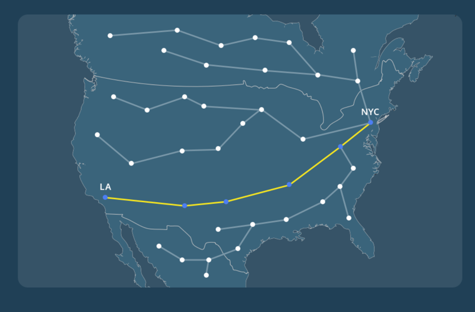
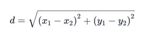
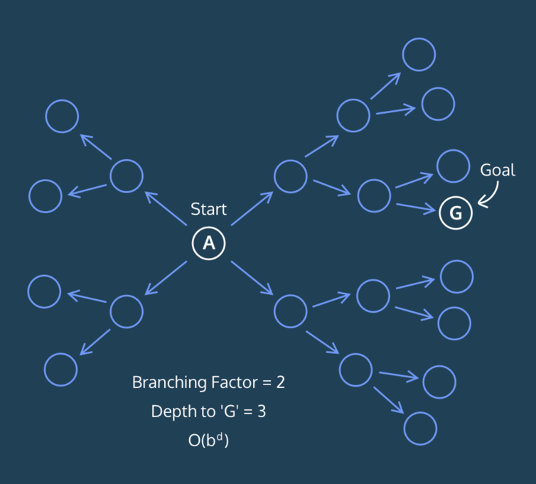

# A*

 Dijkstra’s algorithm is great for finding the shortest distance from a 
  start vertex to all other vertices in the graph. However, it is not the 
  best when we are just looking for the shortest distance from a single 
  start vertex to a single end vertex. Let’s think about this.

 Dijkstra’s algorithm considers **ALL** neighboring vertices and simply pops 
  the vertex with the shortest distance calculated so far from the queue. 
  As a refresher, here’s the pseudocode for Dijkstra’s Algorithm:
 
```text
create dictionary to map vertices to their distance from start vertex

assign start vertex a distance of 0 in min heap

assign every other vertex a distance of infinity in min heap

remove the vertex with the minimum distance from the min heap and set it to the current vertex

while min heap is not empty:
  for each current vertex:
    for each neighbor in neighbors:
    new distance = (distance to current vertex) + (edge weight of current vertex to neighbor)

    if new distance is less than its current distance:
      current distance = new distance

return distances
```

 However, considering vertices that take us away from our goal might be a 
 waste of time. For instance, take a look at the graph below:
 


 What if we modeled all the train stations in North America using a graph 
  and we were looking for the shortest train distance from New York to Los 
 Angeles?

 We shouldn’t consider train stations in Canada because it would be 
  inefficient to look in that direction. However, as shown in the graph on 
  the left, Dijkstra’s looks in all directions, and the algorithm will 
  check all neighboring stations.
 
## What is A*

Instead of checking the distance up to the current verterx, we will check 
 the distance up to the current vertex + the estimated distance from the 
 current vertex to the end vertex. We call this estimated distance the 
 _heuristic_. For instance, in a graph where the vertices are cities, and 
 the edges are roads, we can estimate the distance between two cities 
 through a distance formula:



### Modifications to Dijkstra's Algorithm to turn it into A*
- **Add a target for the search** The new algorithm can't optimize w/ a 
heuristic unless it has a clear destination
- **Gather possible optimal paths and id a single shortest path** You want 
to find a path that has the shortest distance for the least cost
- **Implement a heuristic that determines the likely distance remaining** 
the main difference between Dijkstra's and this new algorithm is that this 
one knows which direction to head in.


 This new algorithm is called `A`*. It’s sometimes referred to as a _greedy 
 algorithm_ because it makes a locally optimal choice at every vertex.  
  The heuristic that A* uses makes it an introductory example of 
 artificial intelligence!

## Runtime of A*


 In A*, we have a goal vertex. Thus, the algorithm is optimized such that 
  in most graphs, every vertex will NOT be searched, so let’s think about 
 how fast this algorithm runs.

Take a look at the graph above.

 Let’s say `A` is the start vertex and `G` is the end vertex. Through A*, we 
  will not be searching many of the vertices left of `A`, so describing the 
  runtime as the same as Dijkstra’s is not very descriptive. Remember that 
  Dijkstra’s has a runtime of `O((V+E) log V)` because in the worst case you 
  search every vertex and go through all the edges while storing data in a 
 min-heap.

 For A*, let’s try describing the runtime in better terms. Using the above 
  graph, let’s call `b` the branching factor of the graph. The branching 
  factor is the _average_ number of edges per vertex in the graph. In this 
  case, **on average**, every vertex has 2 edges, and thus, the branching 
  factor is equal to 2. Let’s call `d` the depth of the goal vertex from the 
  start vertex. Because the goal vertex is 3 edges away from the start 
  vertex, `d` is equal to 3.

 In the worst case, we would look at all of the edges in the direction of 
  the goal vertex until we reach the goal vertex. We would look at `b` edges 
  for every vertex in our search for close to `d` iterations. Thus, the 
  runtime is `O(bd)`.

## Review

- The A* algorithm is a greedy graph search algorithm that optimizes 
looking for a target vertex.
- A* is a modification of Dijkstra’s done by adding the estimated distance 
of each vertex to the goal vertex when searching.
- We can modify Dijkstra’s and turn it into A* by changing the following:
  - Adding a target for the search.
  - Gathering possible optimal paths and identify a single shortest path.
  - Implementing a heuristic that determines the likely distance remaining.
- The runtime of A* is O(bd) where b is the branching factor of the graph 
and d is the depth of the goal vertex from the start vertex.
- A* is an introductory glimpse into artificial intelligence.
