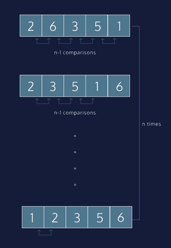

We implement the algorithm with two loops.

The first loop iterates as long as the list is unsorted and we assume it’s unsorted to start.

Within this loop, another iteration moves through the list. For each pairing, the algorithm asks:

In comparison, is the first element larger than the second element?

If it is, we swap the position of the elements. The larger element is now at a greater index than the smaller element.

When a swap is made, we know the list is still unsorted. The outer loop will run again when the inner loop concludes.

The process repeats until the largest element makes its way to the last index of the list. The outer loop runs until 
no swaps are made within the inner loop.

---

BAD (we lose the value at index_1)
```python
list[index_1] = list[index_2]
list[index_2] = list[index_1]
```

Option 1 (Temp Variable)
```python
temp = list[index_1]
list[index_1] = list[index_2]
list[index_2] = temp 
```

Option 2 (Multiple Assignment)
```python
list[index_1], list[index_2] = 
    list[index_2], list[index_1]
```

---

#Algorithm Analysis
Given a moderately unsorted data-set, bubble sort requires multiple passes through the input before producing a sorted list. Each pass through the list will place the next largest value in its proper place.

We are performing n-1 comparisons for our inner loop. Then, we must go through the list n times in order to ensure that each item in our list has been placed in its proper order.

The n signifies the number of elements in the list. In a worst case scenario, the inner loop does n-1 comparisons for each n element in the list.

Therefore we calculate the algorithm’s efficiency as:

\mathcal{O}(n(n-1)) = \mathcal{O}(n(n)) = \mathcal{O}(n^2)O(n(n−1))=O(n(n))=O(n 
2
 )
The diagram analyzes the pseudocode implementation of bubble sort to show how we draw this conclusion.

When calculating the run-time efficiency of an algorithm, we drop the constant (-1), which simplifies our inner loop comparisons to n.

This is how we arrive at the algorithm’s runtime: O(n^2).



---

# Bubble Sort: Optimized
As you were writing Bubble Sort, you may have realized that we were doing 
some unnecessary iterations.

Consider the first pass through the outer loop. We’re making n-1 comparisons.

```python
nums = [5, 4, 3, 2, 1]
# 5 element list: N is 5
bubble_sort(nums)
# 5 > 4
# [4, 5, 3, 2, 1]
# 5 > 3
# [4, 3, 5, 2, 1]
# 5 > 2
# [4, 3, 2, 5, 1]
# 5 > 1
# [4, 3, 2, 1, 5]
# four comparisons total
```
We know the last value in the list is in its correct position, so we never 
need to consider it again. The second time through the loop, we only need 
n-2 comparisons.

As we correctly place more values, fewer elements need to be compared. 
An optimized version doesn’t make n^2-n comparisons, it does (n-1) + (n-2)+ 
... + 2 + 1 comparisons, which can be simplified to (n^2-n) / 2 comparisons.

This is fewer than n^2-n comparisons but the algorithm still has a big 
O runtime of O(N^2).

As the input, N, grows larger, the division by two has less significance. 
Big O considers inputs as they reach infinity so the higher order term N^2 
completely dominates.

We can’t make Bubble Sort better than O(N^2), but let’s take a look at the 
optimized code and compare iterations between implementations!

We’re also taking advantage of parallel assignment in Python and 
abstracting away the swap() function!