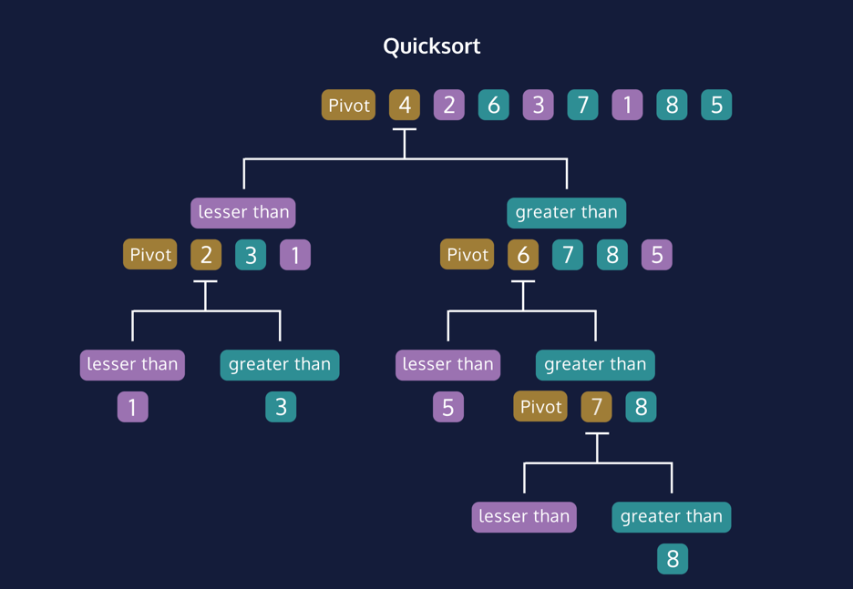

# Introduction to Quicksort
Quicksort is an efficient recursive algorithm for sorting arrays or lists of
values. The algorithm is a comparison sort, where values are ordered by a 
comparison operation such as `>` or `<`.

Quicksort uses a divide and conquer strategy, breaking the problem into smaller sub-problems until the solution is so clear there’s nothing to solve.

<u>The problem</u>: many values in the array which are out of order.

<u>The solution</u>: break the array into sub-arrays containing **at most** 
one element. One element is sorted by default!

We choose a single pivot element from the list. Every other element is 
compared with the pivot, which partitions the array into three groups.

1. A sub-array of elements smaller than the pivot.
2. The pivot itself.
3. A sub-array of elements greater than the pivot.

The process is repeated on the sub-arrays until they contain zero or one 
element. Elements in the “smaller than” group **are never compared** with 
elements in the “greater than” group. If the smaller and greater groupings 
are roughly equal, this cuts the problem in half with each partition step!

```python
[6,5,2,1,9,3,8,7]
6 # The pivot
[5, 2, 1, 3] # lesser than 6
[9, 8, 7] # greater than 6
 
 
[5,2,1,3]  # these values
# will never be compared with 
[9,8,7] # these values
```

Depending on the implementation, the sub-arrays of one element each are
recombined into a new array with sorted ordering, or values within the 
original array are swapped in-place, producing a sorted mutation of the 
original array.

---

# Quicksort Runtime
The key to Quicksort’s runtime efficiency is the division of the array. 
The array is partitioned according to comparisons with the pivot element, 
so which pivot is the optimal choice to produce sub-arrays of roughly equal 
length?

The graphic displays two data sets which always use the _first_ element as
the pivot. Notice how many more steps are required when the quicksort 
algorithm is run on an already sorted input. The partition step of the 
algorithm hardly divides the array at all!

The worst case occurs when we have an imbalanced partition like when the 
first element is continually chosen in a sorted data-set.

One popular strategy is to select a random element as the pivot for each 
step. The benefit is that _no particular data set_ can be chosen ahead of 
time to make the algorithm perform poorly.

Another popular strategy is to take the first, middle, and last elements 
of the array and choose the median element as the pivot. The benefit is 
that the division of the array tends to be more uniform.

Quicksort is an unusual algorithm in that the worst case runtime is `O(N^2)`, 
but the average case is `O(N * logN)`.

We typically only discuss the worst case when talking about an algorithm’s 
runtime, but for Quicksort it’s so uncommon that we generally refer 
to it as `O(N * logN)`.


---
Quicksort is an efficient algorithm for sorting values in a list. A single element, the pivot, is chosen from the list. All the remaining values are partitioned into two sub-lists containing the values smaller than and greater than the pivot element.

Ideally, this process of dividing the array will produce sub-lists of nearly equal length, otherwise, the runtime of the algorithm suffers.

When the dividing step returns sub-lists that have one or less elements, each sub-list is sorted. The sub-lists are recombined, or swaps are made in the original array, to produce a sorted list of values.


---

```python
[5, 6, 2, 3, 1, 4]
# we randomly select "3" and swap with the last element
[5, 6, 2, 4, 1, 3]
 
# We'll use () to mark our "lesser than" pointer
# We'll use {} to mark our progress through the list
 
[{(5)}, 6, 2, 4, 1, 3]
# {5} is not less than 3, so the "lesser than" pointer doesn't move
 
[(5), {6}, 2, 4, 1, 3]
# {6} is not less than 3, so the "lesser than" pointer doesn't move
 
[(5), 6, {2}, 4, 1, 3]
# {2} is less than 3, so we SWAP the values...
[(2), 6, {5}, 4, 1, 3]
# Then we increment the "lesser than" pointer
[2, (6), {5}, 4, 1, 3]
 
[2, (6), 5, {4}, 1, 3]
# {4} is not less than 3, so the "lesser than" pointer doesn't move
 
[2, (6), 5, 4, {1}, 3]
# {1} is less than 3, so we SWAP the values...
[2, (1), 5, 4, {6}, 3]
# Then we increment the "lesser than" pointer
[2, 1, (5), 4, {6}, 3]
 
# We've reached the end of the non-pivot values
[2, 1, (5), 4, 6, {3}]
# Swap the "lesser than" pointer with the pivot...
[2, 1, (3), 4, 6, {5}]


# the pivot, 3, is correctly placed
whole_list = [2, 1, (3), 4, 6, 5]
 
less_than_pointer = 2
start = 0
end = len(whole_list) - 1
# start and end are pointers encompassing the entire list
# pointers for the "lesser than" sub-list
left_sub_list_start = start
left_sub_list_end = less_than_pointer - 1
 
lesser_than_sub_list = whole_list[left_sub_list_start : left_sub_list_end]
# [2, 1]
 
# pointers for the "greater than" sub-list
right_sub_list_start = less_than_pointer + 1
right_sub_list_end = end
greater_than_sub_list = whole_list[right_sub_list_start : right_sub_list_end]
# [4, 6, 5]
```