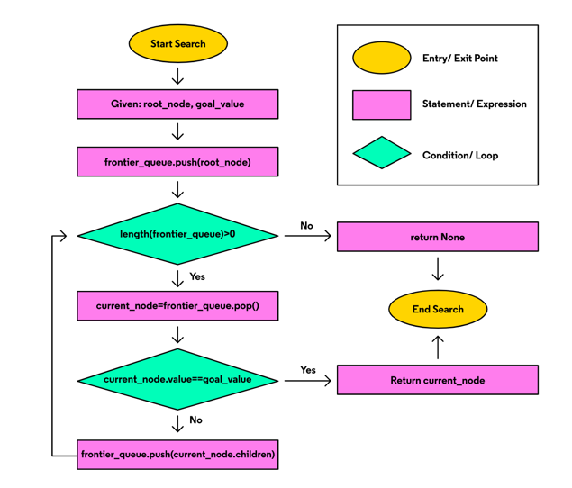
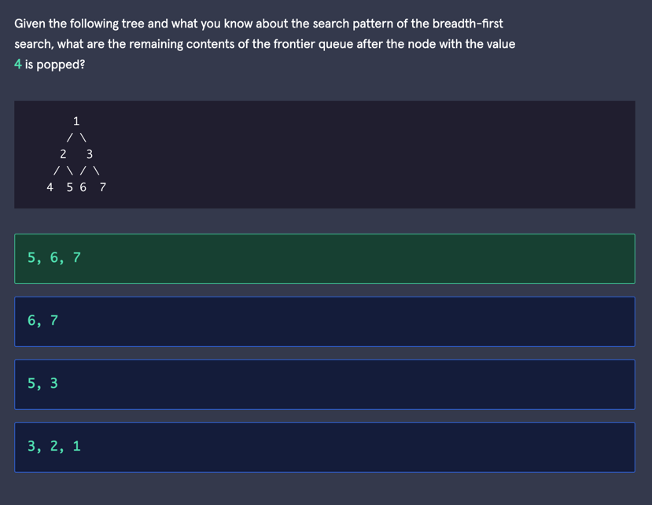
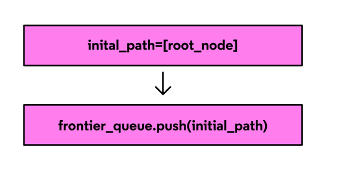
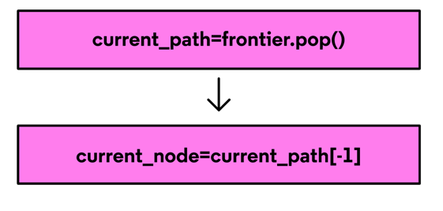
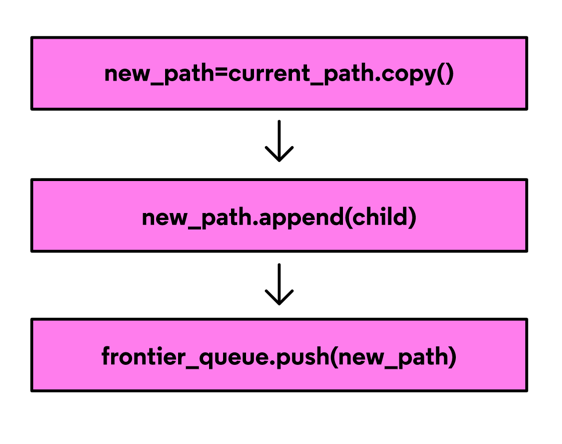
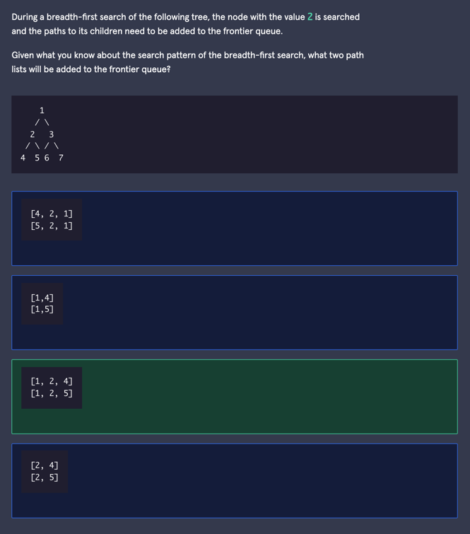

# Breadth-First Search: Conceptual
Learn how the breadth-first search tree traversal algorithm works using an iterative approach and frontier queue.

The breadth-first search is a tree traversal algorithm that follows a level-by-level search pattern, starting with the root node on top and moving to each level in search of a goal node. As nodes of a tree are searched, their children are added to a queue known as the frontier. This queue follows the first-in-first-out rule known as FIFO where the first nodes added to the queue will be the first to leave and be searched.

In this article, we will explore the breadth-first search algorithm using an iterative approach.

##  Level-By-Level Search
The level-by-level pattern followed by the breadth-first search can feel very approachable since it is just like searching for a specific word in a book or even this article. Every word is checked line by line with no word or line skipped. Similarly, the breadth-first search iteratively checks child nodes in the order they are placed in a queue.

## Breadth-First Search Algorithm
The following flow chart represents an iterative breadth-first search algorithm that either locates a goal node based on a given goal value or returns a failure state.

Let’s go over the steps for implementing this algorithm:

- The search starts with two values, a root node for the tree and the goal 
value we are searching for.
- Our first search step is to add the root node to the end of our node 
  queue. The queue represents the search’s frontier.
- While the node queue contains at least one value, we retrieve the next 
  node from the frontier and check its value against the goal value.
- If the two values match, the current node is returned. If they don’t 
  match, the search continues by adding the current node’s children to the frontier.

The search goes level by level in search of the value because the children on the next tree level added to the queue will be in line behind nodes on the current level.

### Tracking the Path to the Goal Node
Now that we covered how to locate the goal node in a tree we must now look at how to find the path to the goal node from the root node. To do this with the iterative algorithm, a few extra steps need to be added. These steps will keep track of every frontier node’s path from the root node.

The flow chart above shows the extra steps needed to initialize the frontier:

- Define an initial path with the root node inside a list data type.
- Push the initial path onto the frontier queue.

The above flowchart shows how to retrieve the current node:

Pop the current path off the frontier.
Retrieve the current node from the end of the current path.

To add children to the frontier the above flowchart shows that for each child:

- Define a new path from a copy of the current path.
- Add the child node to the end of the new path.
- Push the new path onto the frontier queue.

Given a root node with two children, the end of the first search iteration will have two lists in the frontier queue:
- a list with the root node and one child as elements
- a list with the root node and the other child as elements

The frontier queue holds a path list for each frontier node with the root node as the first element. When the goal node is found, the current path is returned.
