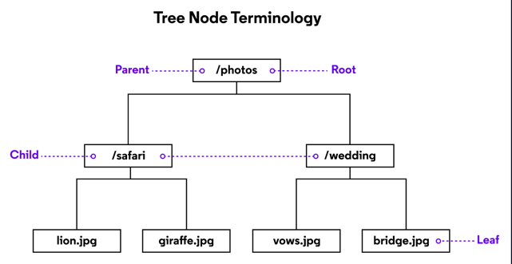
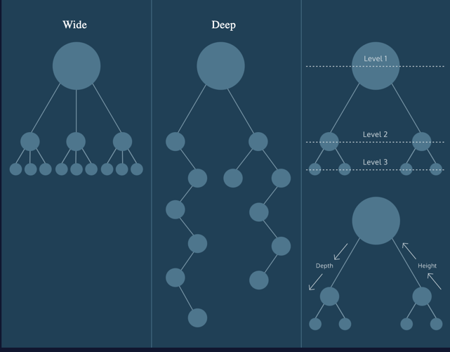

# Trees: Conceptual

## Introduction
Trees are an essential data structure for storing hierarchical data with a directed flow.

Similar to linked lists and graphs, trees are composed of nodes which hold data. The diagram represents nodes as rectangles and data as text.

Nodes also store references to zero or more other tree nodes. Data moves down from node to node. We depict those references as lines drawn between rectangles.

Trees are often displayed with a single node at the top and connected nodes branching downwards.

Trees grow downwards in computer science, and a root node is at the very top. The root of this tree is **/photos**.

**/photos** references to two other nodes: **/safari** and **/wedding**. 
**/safari** and **/wedding** are children or child nodes of **/photos**.

Conversely, **/photos** is a _parent_ node because it has child nodes.

**/safari** and **/wedding** share the same parent node, which makes them _siblings_.

Note that the **/safari** node is child (to **/photos**) and parent (to 
**lion.jpg** and **giraffe.jpg**). It’s extremely common to have nodes act as
both parent and child to different nodes within a tree.

When a node has no children, we refer to it as a _leaf_ node.

## Tree Varietals
Trees come in various shapes and sizes depending on the dataset modeled.

Some are wide, with parent nodes referencing many child nodes.

Some are deep, with many parent-child relationships.

Trees can be both wide and deep, but each node will only ever have at most 
one parent; otherwise, they wouldn’t be trees!

Each time we move from a parent to a child, we’re moving down a _level_. 
Depending on the orientation we refer to this as the _depth_ **`(counting 
levels down from the root node)`** or _height_ `(counting levels up from a leaf 
node).`

Review
Trees are useful for modeling data that has a hierarchical relationship
that moves in the direction from parent to child. No child node will have more than one parent.

To recap some terms:

<u>**root**</u>: A node which has no parent. One per tree.  
<u>**parent**</u>: A node which references other nodes. 
<u>**child**</u>: Nodes referenced by other nodes. 
<u>**sibling**</u>: Nodes which have the same parent. 
<u>**leaf**</u>: Nodes which have no children. 
<u>**level**</u>: The height or depth of the tree. Root nodes are at 
level 1, their children are at level 2, and so on. 