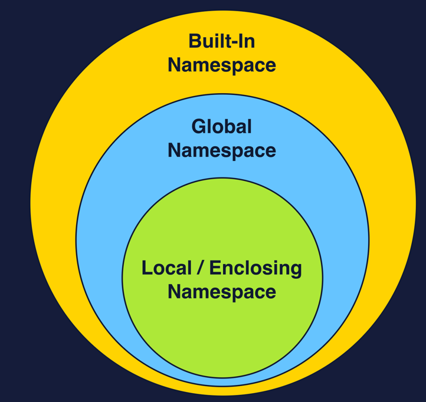
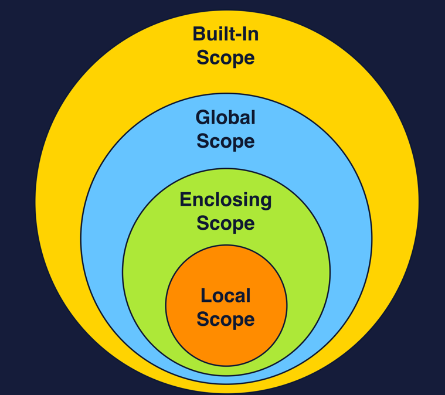

# Namespaces and Scope

## Namespaces

### Built-In Namespace
- Highest level
- functions like `print()` and `str()` are part of this namespace, and therefore available to any Python program we write. 
- accessed via `__builtins__`

### Global Namespace
- 2nd highest namespace
- includes all non-nested names in the module/file we are choosing to run the Python interpreter on. 
- created when we run our main program
- ends when the interpreter terminates
- can be accessed via `globals()`

```python
print(' -- Globals Namespace with empty script -- \n')
# Write Checkpoint 1 here: 
print(globals())

# Write Checkpoint 2 here: 
global_variable = 'global'

# Write Checkpoint 3 here: 
def print_global():
  global_variable = 'nested global'
  nested_variable = 'nested value'

print(' \n -- Globals Namespace non-empty script -- \n')
# Write Checkpoint 4 here: 
print(globals())
```

### Local Namespace
- deepest/3rd level
- accessed via `locals()`

```python
global_variable = 'global'

print(' -- Local and global Namespaces with empty script -- \n')
# Write Checkpoint 1 here:
print(locals())
print(globals())

# Write Checkpoint 2 here:
def divide(num1, num2):
  result = num1 / num2
  print(locals())

# Write Checkpoint 3 here:
def multiply(num1, num2):
  product = num1 * num2
  print(locals())

print(' \n -- Local Namespace for divide -- \n')
# Write Checkpoint 4 here:
divide(3, 4)

print(' \n -- Local Namespace for multiply -- \n')
# Write Checkpoint 5 here:
multiply(4, 50)

print(' \n -- Local Namespace final -- \n')
# Write Checkpoint 6 here:
print(locals())
```

### Enclosing Namespace
- These are internal namespaces that are created specifically when we work w/ nested functions
- just like w/ the local namespace, they only exist for the lifetime of the function execution

```python
global_variable = 'global'
 
def outer_function():
  outer_value = "outer"
 
  def inner_function():
    inner_value = "inner"

    def inner_nested_function():
      nested_value = 'nested'
    inner_nested_function()
    # Add locals() below
    print(locals())
  inner_function()
 
outer_function()
```

----

## Scope

### Local Scope

#### Wrong!
This causes an error because the name color is out of scope.
```python
def favorite_color(): 
  color = 'Red'
 
print(color)
```

#### Fixed It!
```python
def favorite_color(): 
  color = 'Red'
  print(color) 
 
favorite_color()
```

### Enclosing/Nonlocal Scope

#### Nested Functions
```python
def calc_paint_amount(width, height):

  square_feet = width * height
  # Write your code below!
  def calc_gallons():
    return square_feet / 400
  return calc_gallons()

print('Number of paint gallons needed: ')
print(str(calc_paint_amount(30,20)))
```


#### Caveat 1 - Flow of Scope
- The flow of scope access only flows upwards
- The deepest level has access to every enclosing namespace above it, but not the other way around.

```python
def outer_function():
  enclosing_value = 'Enclosing Value'
  print(nested_value)
 
  def nested_function():
    nested_value = 'Nested Value'
 
  nested_function()
 
outer_function()
```
The above example is out of scope. The `print()` statement can't reach the `nested_value` name. 

#### Caveat 2 - Immutable Objects
Immutable objects such as strings or numbers can be accessed in nested functions, but can't be modified. 
```python
def outer_function():
  enclosing_value = 'Enclosing Value'
 
  def nested_function():
    enclosing_value += 'changed'
 
  nested_function()
  print(enclosing_value)
 
outer_function()
```
This provides an error, because enclosing_value's scope is referenced inside `nested_function()` where it's scope "starts".
The assignment statement in `outer_function` technically happens later. 

### nonlocal statement
The `nonlocal` statement allows the modification of names in the enclosing scope

```python
def enclosing_function():
  var = "value"
 
  def nested_function():
    var = "new_value"
 
  nested_function()
 
  print(var)
 
enclosing_function()
```
The output value would be: `value`
- var is first set as new_value inside `nested_function()`
- var is reassigned as value in the `enclosing_function()`

Even though we call `nested_function()` afterwards, there is no parameter or return statement to create `sequence` with the outer function. 
This means that the variable isn't modifiable within the nested function. 

```python
def enclosing_function():
  var = "value"
 
  def nested_function():
    nonlocal var
    var = "new_value"
 
  nested_function()
  print(var)
 
enclosing_function()
```
By marking the variable as `nonlocal`, we're declaring that the `var` inside the local scope is the same variable that is defined in the enclosing scope. 
This establishes `sequence`, so that calling nested_function() modifies the variable. 


#### Example: 
```python
walls = [(20, 9), (25, 9), (20, 9), (25, 9)]


def calc_paint_amount(wall_measurements):

  square_feet = 0

  def calc_square_feet():
    
    for width, height in wall_measurements:
      # This makes square_feet modifiable in 
      # enclosing scope
      nonlocal square_feet
      square_feet += width * height

  def calc_gallons():
    return square_feet / 400

  calc_square_feet()

  return calc_gallons()


print('Number of paint gallons needed: ')
print(str(calc_paint_amount(walls)))
```

## Global Scope
Example
```python
# global scope variable
gravity = 9.8
 
def get_force(mass):
  return mass * gravity
 
print(get_force(60))
```


Similar to local scope, values can only be accessed. They can't be modified. The following example will cause an error: 
```python
# global scope variable
gravity = 9.8
 
def get_force(mass):
  gravity += 100
  return mass * gravity
 
print(get_force(60))

# OUTPUT:
UnboundLocalError: local variable 'gravity' referenced before assignment
```

### global statement
This works like nonlocal, but rather than being used to extend mutability from local to enclosing scope, the `global` statement allows modification of global names from a local scope. 

#### Accessible Only
In this example, the global variable isn't modifiable from local scope, 
so the call to `some_function()` is benign.
```python
global_var = 10
 
def some_function():
  global_var = 20
 
some_function()
 
print(global_var) # 10
```

#### Mutable
In this example, the variable is marked as global, 
making it mutable from the local scope.
```python
def some_function():
  global x
  x = 30
 
some_function()
print(x)
```

# LEGB RULE (Scope Resolution)
`Scope Resolution` is a term used to describe a search procedure for a name in the various namespaces. 
- `L`ocal
- `E`nclosing
- `G`lobal
- `B`uilt-In