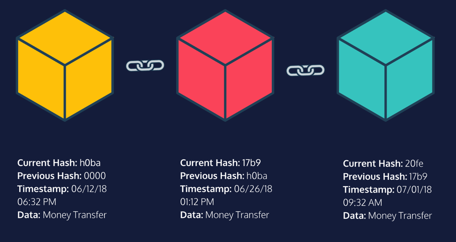

# Blockchain

The blockchain is similar to a permanent book of records that keeps a log 
of all transactions that have taken place in chronological order.   

Let’s envision a bank transaction in which there are three parties: the 
sender, the bank, and the recipient. In order to ensure that there are no 
fraudulent transactions, the bank acts as the central authority between 
the parties.    

The blockchain also logs transactions between senders and receivers, 
except there is no bank or central authority. Instead, the blockchain 
relies on a public network of computers to verify the transaction. The 
blockchain is just an accurate, and permanent record of all the 
transactions that have happened amongst the members in that blockchain’s 
network. In this analogy, each block in the blockchain represents a 
transaction, and each transaction is connected to the prior transaction to 
form the entire connected blockchain.        

Key Terms:

- `Block`: A block is an individual transaction or piece of data that is 
being stored within the blockchain.
- `Blockchain`: A blockchain is a continuously growing list (“chain”) of 
records (“block”), called blocks, which are linked chronologically and 
secured using cryptography.  

## The Blockchain Network

In the blockchain, there are many participants in the network that are 
constantly checking to ensure that each transaction is valid. Each 
participant is a computer that owns a copy of the blockchain. These 
participants cross-reference their copy of the blockchain each time a new 
block is being introduced. Because this validation depends on multiple 
participants, the digital record is “**decentralized**”.     

In order for a new block to be added, _**51% of all of the participants in 
the blockchain network must verify that the new block is not fraudulent**_. 
Once a block has been verified as a valid transaction, it is added to each 
participant’s copy of the blockchain.    

By having the majority of participants validate a new transaction, the 
blockchain removes the need for a central authority and automates the 
completion of transactions, reducing transaction fees while ensuring a 
high level of security.    

Key Terms: 

`Blockchain Network`: The blockchain network and blockchain are terms used 
interchangeably. They represent the entire blockchain from the structure 
itself to the network that it is a part of.   

`Decentralization`: The concept in which participants work together to 
validate transactions without relying on a central authority.  

`Participant`: A client that owns a copy of the blockchain and verifies 
transactions across the network. 

## Blocks

A `block` contains transaction data and other important details related to 
the creation of that block, such as the time when it was created and other 
unique information. In order to create a block, we must have a record that 
we wish to store.    

In this lesson, we will be discussing transaction data. This is just one 
example, but blocks can hold different types of data depending on what the 
blockchain is used for. However, at its heart, a block will always contain 
a timestamp or the data regarding the time when the block was created. A 
block will also always contain a unique `hash` or a unique code produced by 
combining all the contents within the block itself — also known as a 
digital fingerprint. Lastly, a block will also always contain a `previous 
hash` or a reference to the prior block’s hash. This reference to the prior 
block is how blocks chain to one another. We will dive into more details 
about the hash later. These attributes about a block are what make it part 
of a blockchain structure.           

Properties in a Block:

- **Timestamp**: The time the block is created determines its location on 
the chain
- **Transaction Data**: The information to be securely stored in the block
- **Hash (Digital Fingerprint)**: A unique code produced by combining all the 
- contents within the block itself. 
- **Previous Hash**: Each block has a reference to the block prior to its 
hash. This is what makes the blockchain unique, because this link will 
be broken if it is tampered with. 

## Hashing

An application of cryptography that is fundamental to the design of the 
blockchain. It is a way to generate a seemingly random, but calculated 
string of letters and numbers from any input. This is accomplished by the 
use of a `hash function`.    

Think of a hash function as a machine that takes an object, such as an 
apple, and turns it into a varying combination of letters and numbers, 
such as “1a432bf”. The output (“1a432bf”) is known as the hash of the 
input, the apple. If you give the machine two apples instead of one, it 
will return a different hash (such as “26f5ce1”).    

There are many types of machines out there, so the resulting hash varies 
from machine to machine. Similarly, there are many types of hash functions 
available. Blockchain uses a cryptographic hash function, meaning that the 
output is random but deterministic. This means the same input will always 
produce the same hash. That process is one-way, so the output (hash) 
cannot be used to produce the original input.     

Blockchain's hash includes the Transaction Data, Timestamp and previous Hash. 

Key Terms: 

- `Deterministic`: The same input will always produce the same output, but 
that output cannot produce the original input. 

- `Hash`: A calculated string of letters and numbers produced from a 
specific input. 

- `Hash Function`: A function that takes in an input of a random size, 
performs hashing on the input, and generates a seemingly random output of 
a fixed size, also known as the hash.   

## The Genesis Block

A blockchain is similar to a permanent book of records — it keeps an 
accurate unchanging record of all data, or transactions, stored in 
chronological order. _Each block has a reference to the block’s previous 
hash. This is how blocks are “chained” together._ If a block’s contents are 
tampered with, the block’s hash changes and the chain breaks, making it 
difficult to successfully tamper with any one piece of the chain.      

Since all blocks in the blockchain have a reference to the previous block, 
the first block is a little different than the rest. It is known as the 
`Genesis Block.` The problem, however, is that the Genesis Block does not 
have a block before it. So it wouldn’t make sense to have a previous hash 
stored inside it. To resolve this minor issue, the value of the previous 
hash is typically hard-coded into the Genesis Block with the default value 
of zero.      

Key Terms:

`Genesis Block`: The genesis block is the first block on the blockchain and 
it is typically hard-coded into the blockchain structure. Being the first 
block on the blockchain, it does not have a link to a previous hash.  

---

## Gathering Blockchain Transactions

Blockchain is a secure digital ledger that records transactions in 
chronological order. As they are carried out, they get placed in a special 
location called the `mempool` that collects all of the unvalidated 
transactions. The latest transactions in the `mempool` are broadcasted to 
all blockchain participants. 

Each participant collects these transactions into a new block. Since each 
block can only hold a limited number of transactions at any given time, 
not all transactions can be added at once. 

Once a block is full, the next set of transactions will have to wait in 
the memory pool. At this point, the block is said to be `unconfirmed`, and 
the transactions inside the block are said to be "invalidated"

Key Terms: 

`Transactions`: Exchange of value among participants on the blockchain 
network. 

`Participants`: Individuals accessing the blockchain network through 
computers to exchange 

`Unconfirmed`: Blocks and transactions that are yet to be verified. 

## Adding More Blocks

The first step in adding blocks is **_verifying transactions_**. This means 
making sure that transactions haven’t been swapped or duplicated. For 
simplicity, we will assume that all participants know how to verify 
transactions and that they will verify them honestly. 

The next step is **_establishing a consensus in the network_**. In other words, 
the entire network needs to agree to the transactions.  

Assuming everyone honestly verified the transactions, a random participant 
broadcasts their block to the entire network. If more than 51% of the 
participants agree with the block, a consensus has been reached, and the 
block is now said to be confirmed!   

However, the network might not agree on the first try. This would happen 
if someone tried to share an invalid block. The network would reject the 
attempt at introducing a fake transaction!  

The key takeaway from this exercise is that — _as long as the majority of 
participants verify transactions honestly, the blockchain remains secure_.  

Key Terms:

`Consensus`: The process of agreeing to the transactions on the blockchain 
network.

## Maintaining the Blockchain's Integrity Through Hashing

In a blockchain, each block has a unique hash and a link to the previous 
block’s hash. If a participant decides to tamper with a block by modifying 
the transactions, the block’s unique hash gets changed. However, the 
following block does not update to reflect this change — it still points 
to the previous block’s hash. Thus, there is a mismatch between hashes and 
the link between blocks is broken. This results in an invalid copy of the 
blockchain.      

In this way, the records in the blockchain cannot be altered. In other 
words, the records are said to be immutable.  

Key Terms:

- `Hashing`: generating a random string of characters from a given input

- `Immutable`: Something whose records can't be changed

## Hashing and Security

Let’s say we have three blocks: A, B, and C with hashes X123, Y456, and 
Z789 that represent the state of each block. If an attacker tampers with 
Block A, its contents get changed, so its hash gets changed — let’s say 
the hash is changed from X123 to 123X. Block B no longer points to Block A 
because the previous hash X123 no longer matches with the new hash 123X. 
The only way for the attacker to make the chain valid is by fixing this 
mismatch. For Block B to point to Block A, its previous hash needs to be 
changed from X123 to 123X.       

However, this also counts as tampering with Block B’s data. Thus, its hash 
also gets changed. If the attacker repeats this process for all subsequent 
blocks, they will have succeeded in creating a valid copy of the 
blockchain!   

Key Terms: 
- `Recalculating Hashes`: Replacing the incorrect hash with a "correct" 
one to validate the chain. 

## Securing the Blockchain Further

Hasing on its own is not enough to secure the entirety of the blockchain. 
There needs to be another layer of security to protect the blockchain from 
outside interference. Allowing anyone to tamper with their copy of the 
blockchain and trick everyone on the network to update their copies is a 
big problem.     

An additional requirement needs to be introduced that **makes it infeasible 
for someone to tamper with subsequent blocks and take over the blockchain**.  

Just like how the bank has an accountant to verify transactions manually, 
the blockchain has a clever technique called Proof-of-Work that 
accomplishes two important goals:  

- It makes it difficult for participants to modify blocks by re-calculating 
hashes.
- It relies on bulletproof cryptography instead of anonymous participants 
to verify transactions.

This essentially creates a trustless system and is the main reason why the 
blockchain is so secure and powerful. 

Key Terms: 

- `Proof of Work`: A security feature used in blockchain to prevent 
attackers from easily taking over the blockchain.

- `Trustless`: A feature of blockchain that states how the system doesn't 
rely on any participant to verify transactions. 

### Proof of Work

Since participants on the blockchain network are anonymous users on their 
computers, we can’t trust them to verify transactions honestly. 

`Proof-of-Work` does nothing more than introduce an additional security 
constraint to verify transactions. This constraint takes the form of a 
computationally difficult math problem, which means to say that it takes a 
lot of time even for the computer to solve the problem.     

Instead of randomly being chosen to broadcast their unconfirmed block, a 
special group of participants, also known as miners, now need to solve a 
problem in order to be eligible to broadcast their block. The problem, 
also known as Proof-of-Work, takes the form of a guessing game that 
involves the use of hashing.    

The hash function that’s most commonly used to create the hash for the 
block is the SHA-256. Miners first guess a nonce value, which is then 
combined with the contents of the block (i.e transactions, timestamp, hash,
and previous hash). They repeat this process until the desired hash is 
generated.    

The first miner to produce a proof broadcasts their unconfirmed block 
together with the correct nonce value. The rest of the network then 
verifies the calculation. If the majority of the participants agree, the 
Proof-of-Work for the block is now complete and the block has now been 
confirmed! The network then moves on to work on the next block.     

Here’s an example of a simple problem — find a number which, when combined 
with the unconfirmed block’s contents, produces a hash whose first four 
digits equals 0000. Every participant uses their computer and a hash 
function (typically SHA-256) to find a number that generates a correct 
hash. Since this a random guessing game, everyone usually starts out with 
0 and increases their guesses until they produce an acceptable hash.      

**_The blockchain participants always consider the longest chain to be the 
correct one._** If someone is able to create the longest chain of blocks 
(even if the blocks are fake), the network is forced to accept the new 
chain.   

The reason for this is simple 
— the blockchain network assumes that the 
  longest chain has the most amount of computational work done in finding 
 the Proof-of-Work for each block. Therefore, it is reasonable for the 
 network to think that the longest chain contains the most proven record 
 of transactions.

If a dishonest participant decides to tamper with a block, they would have 
to solve the Proof-of-Work for each subsequent block in order to introduce 
the tampered block into the network. This is computationally infeasible 
and almost impossible!   

Furthermore, while the participant is busy finding the Proof-of-Work for 
each block, newer blocks are being added to the blockchain at a faster 
rate. The participant soon finds out that they are playing a losing battle 
against the entire network.   

What is the key takeaway from all this? A block gets increasingly more 
tamper-proof as newer blocks are added next to it. Proof-of-Work makes it 
hard to get through the entire blockchain and allow someone to introduce a 
fake transaction.    

Key Terms:

`Miners`: Special participants who calculate the Proof-of-Work to mine new 
blocks. 

`Nonce`: A number to be guessed by miners which when combined with the block 
produces an acceptable hash. 

`Longest Chain`:  The most trusted chain w/ the largest amount of 
computational work done in calculating `Proof of Work`

