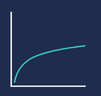
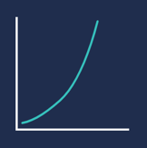
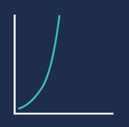
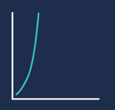
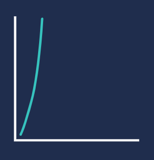

# What is Asymptotic Notation

    calculating a program's runtime by looking at how
    many instructions the computer has to perform 
    based on the program's input: N


<u>CONSTANTS</u> 

we drop our constants, because as N becomes extremely
large, the constants make small differences. 


<u>Execution Count</u>

More precise than Big O, but regardless of  _execution count_, 
the no. of operations grows _roughly_ proportionate to
n.

---

# Big Theta

    Used when a program has ony ONE CASE in terms of
    RUNTIME.


## Example 1:

```python
def function(my_list):
    N = len(my_list)
    for item in my_list:
        print(item)

```

| **Size of List** | **No. of Iterations** |
|------------------|-----------------------|
| 1                | 1                     |
| 2                | 2                     | 
| 3                | 3                     |
| N                | N                     |


## Example 2

```python
def function(N):
    count = 0
    while N <= 1:
        count += 1
        N = N / 2
    return count
```

| **Size of List** | **No. of Iterations** |
|------------------|-----------------------|
| 1                | 0                     |
| 2                | 1                     | 
| 4                | 2                     |
| 8                | 3                     |
| 16 | 4|
| N | log 2 N |


---

# Common Runtimes

### Constant Θ(1)
    
    A program will always do the same thing, 
    regardless of the input


### Logarithmic Θ(log N)

    Common in search algorithms.



### Linear Θ(N)

    Seen when you have to iterate through an
    entire dataset.


### Θ(N * log N)

    Seen in sorting algorithms



### Polynomial Θ(N^2)

    Searching through 2D datasets (i.e. matrix)
    or nested loops



### Exponential Θ(2^N)

    Shows up in recursive algorithms



### Factorial Θ(N!)

    See this when you have to generate all
    of the different permutations of something
    (power_set!)




---

# Big Omega Ω and Big O (O)

    Used to describe the best and worse
    case runtimes respectively

### Example 1
```python
def function(my_list):
    N = len(my_list)
    for element in my_list:
        if element == 12:
            return True
    return False
```

<u>Best Case</u>
- Θ(1)
- Ω(1)

<u>Worst Case</u>
- Θ(N)
- O(N)


In most cases, you'll usually only be asked for
Big O (The Worst Case)