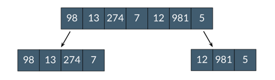
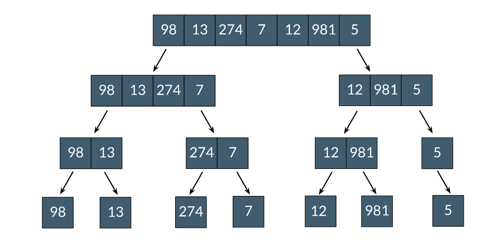
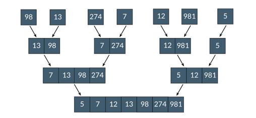
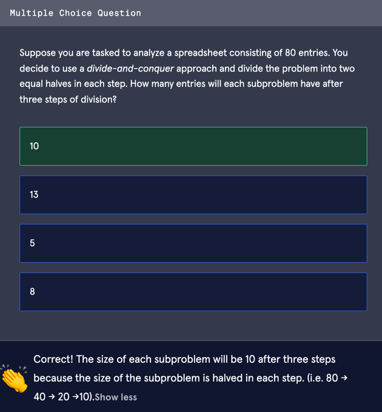
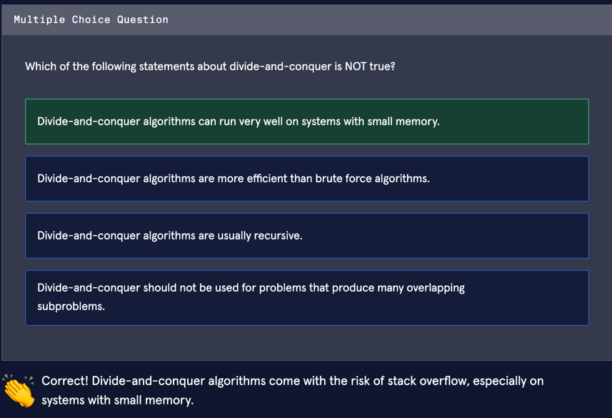

# Divide and Conquer Algorithms

 In programming, we often encounter problems that are too complex to be 
  solved as a whole. To deal with such problems, we can use an algorithm 
  paradigm called _divide-and-conquer_. A divide-and-conquer algorithm 
  solves a large problem by recursively breaking it down into smaller 
  subproblems until they become simple enough to be solved directly.

 A real-life analogy for divide-and-conquer would be like eating a cookie: 
  It’s impossible to swallow a cookie whole, so we chew it until the 
 pieces become small enough to be swallowed.

 In this article, we will discuss how divide-and-conquer algorithms work, 
  their time and space complexities, and when to utilize them.
 
## Divide and Conquer in Three Steps

The divide-and-conquer strategy is a three-step process:

- <u>**Divide**</u>: Recursively divide a big problem into smaller 
  subproblems.
- <u>**Conquer**</u>: Solve the subproblems after they become small enough.
- <u>**Combine**</u>: Merge the subproblems to get the desired solution.
 
This process might look familiar to you because it is the principle 
 behind [merge sort](https://www.codecademy.com/paths/pass-the-technical-interview-with-python/tracks/sorting-algorithms-python/modules/merge-sort-python/lessons/merge-sort-conceptual). Let us review merge sort and understand how it 
 utilizes divide-and-conquer to efficiently sort an array.

The given array to be sorted is:

### Divide
 First, we need to divide into smaller subproblems. In merge sort, the 
  array is split into two halves in each step. After the first step, the 
 array will look like this:

 But wait, the subproblems are still not small enough to be solved. We 
  need to recursively divide the problem until every subarray only 
  contains one number:
 
At this point, the subproblems are 
  considered solved on their own because an array consisting of only one 
  number is sorted.

### Conquer & Combine
 Now it’s time to combine the subproblems together. “Conquer” will work 
  side by side with “combine” in the following steps, in the sense that we 
 need to merge two subarrays in the correct order.

 After all the subproblems are combined, we get the sorted array as the 
 result.
 
 

## Time & Space Complexities
 There is no single time or space complexity that can describe all 
  divide-and-conquer algorithms. However, we can follow these general 
  rules to determine the big-O runtime of a specific algorithm:

- Because the problem is divided into at least 2 subproblems at each step, 
the number of steps needed to divide the problem is `log(n)`.
- The cost of solving and merging the subproblems is a factor as well. This 
  is often multiplied by the cost of division to get the overall runtime.

 For merge sort, division takes `O(log(n))` time, and combining the sorted 
 sublists takes `O(n)` time. Therefore, merge sort has a big-O runtime of 
 `O(nlog(n))`.

 The space complexity also varies from algorithm to algorithm. 
  Divide-and-conquer usually requires more space than other paradigms due 
 to the overhead of the recursion stack.
 
## Pros and Cons
Divide-and-conquer has several advantages:

1. It let us solve conceptually complex problems by breaking them into 
smaller subproblems.
2. It has a better asymptotic cost than brute force approaches and is used 
   in many efficient algorithms such as merge sort and quicksort.
3. It makes efficient use of memory caches, which are the fastest type of 
   memory units in a computer.

However, it does have some issues as well:

1. Since divide-and-conquer algorithms are usually implemented recursively, 
 they require additional memory allocation on the stack. If a 
    divide-and-conquer algorithm is executed without sufficient memory, a 
   stack overflow error will occur.
2. Divide-and-conquer cannot avoid evaluating the same subproblem repeatedly,
   making it a bad fit for problems that have overlapping subproblems.

