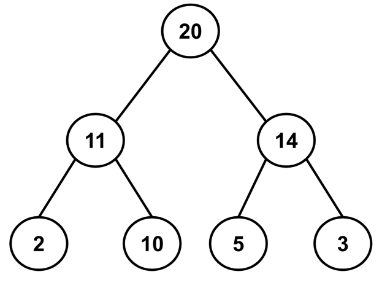

# Heapsort: Conceptual

An algorithm that sorts arays by inserting the data into a `heap` data 
structure and then repeatedly extracts the root of that heap. It is a 
particularly time-efficient algorithm due to its `O(n log n)` time 
complexity in every case. 

## The Algorithm

- Build a max-heap to store the data from an unsorted list
- extract the largest value from the heap and place it into a sorted list
- Replace the root of the heap w/ the last element in the list. Then 
  rebalance, the heap. 
- Once the max-heap is empty, return the sorted list. 

### Build a Max-Heap

Example list of unsorted values: 
```text
[14, 11, 2, 20, 5, 10, 3]
```
Place the values into a max-heap data structure

```text
[20, 11, 14, 2, 10, 5, 3]
```
or



### Extract the Root of the heap. 
 In order to sort our data, we’ll repeatedly extract and remove the 
  largest value from the heap until it’s empty. By following the rule of 
  heaps, we can expect to find the largest value located at the root of 
 the heap.

 After removing the largest value, we can’t just leave our heap without a 
  root because that would cause us to have two orphaned nodes. Instead, we 
  can swap our root node with the last element in the heap. Since the last 
  element has no children, we can easily remove the value from the heap.

 This step does cause one major problem. By swapping the two elements, our 
  root node isn’t the largest value in the heap! We’ll need to restructure 
  the heap in order to ensure that it’s balanced.

### Restore the heap: heapify down

 With the root value no longer holding the largest value, we’ve violated 
  an important rule about heaps: the parent must contain a value that is 
  larger than its children’s values.

 We can fix this though! In the previous lesson, we learned how to heapify 
  up: adding a value to the end of a heap and working our way up the data 
  structure to find its correct placement. Now we need to heapify down. To 
  heapify down, we’ll first compare our new root value to its children. 
  Then, we’ll select the child with the larger value and swap it with the 
  root value. We’ll continue working our way down the heap until it is 
  balanced again:
 
```text
START

       20
     /     \
    11     14
   /  \   /  \
  2   10  5   3

Remove 20

       X
     /     \
    11     14
   /  \   /  \
  2   10  5   3
     

Right-most child (14) Moves Up. 14 is greater than 11.      
    
       14
     /    \
    11      X
   /  \   /  \
  2   10  5   3


Right-most Child (3) Moves Up. 3 is not greater than 5...

       14
     /    \
    11      3
   /  \   /  \
  2   10  5   X
  

Swap-em!

       14
     /    \
    11      5
   /  \   /  
  2   10  3   


```

 In the example above, we swap the original root value 20 with the 
  right-most child 3. With 3 as the new root, we compare the value to its 
  child value, 14. Since 14 is greater than 3, we will swap the two values 
  and make 14 the new root. Next, we’ll compare 3 to its new child value, 
 5. Once again, the child value is greater than its parent, so we will 
     swap 3 and 5. With no more children to compare 3 to, our heap has 
    been rebalanced.