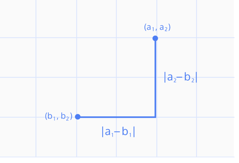
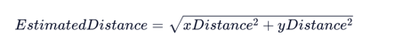
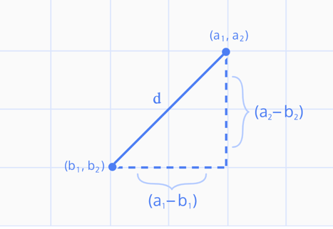

# Heuristics

## Admissible
- it never overestimates the distance in reaching the target in a grid 
- system in which the search can only move up, down , left or right. 


## `Manhattan Heuristic`
- Best use case is when vertices are distributed across a grid w/ no 
diagonal movement 

```python
def heuristic(start, target):
    x_distance = abs(start.position[0] - target.position[0])
    y_distance = abs(start.position[1] - target.position[1])
    return x_distance + y_distance
```




## Inadmissible

In some cases, not all vertices are on a grid and sometimes the shortest 
distance is closer to a direct diagonal line between two points. 

The `Manhattan Heuristic` would overestiamte the total distance, making it
"inadmissible. "

### Euclidean Heuristic 

The Euclidean heuristic works off of the [Pythagorean theorem](https://en.wikipedia.org/wiki/Pythagorean_theorem):



 When you think about it, what we are finding is essentially a hypotenuse 
  of a right triangle; the other two sides would be the x-distance and the 
 y-distance.
 


There are trade-offs:
- a more exact calculation requires an extended runtime due to the 
mathematical calculation (square root)