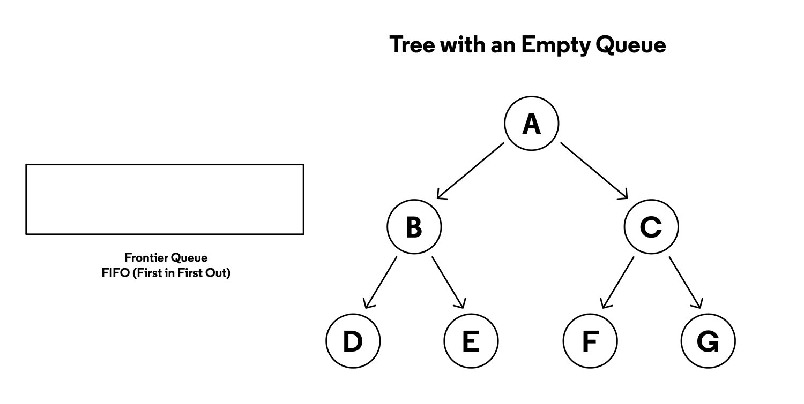
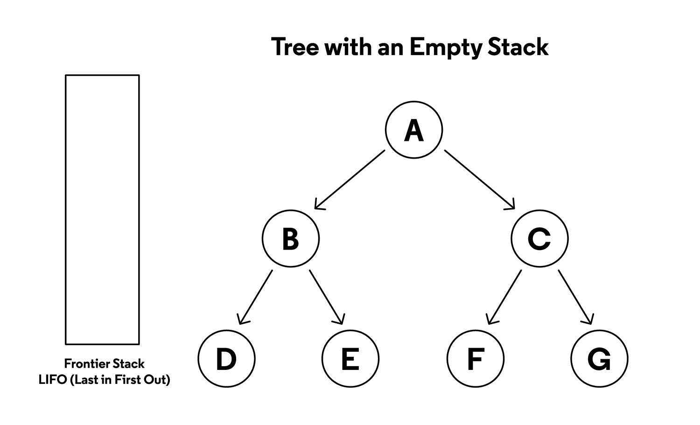

# Tree Traversal: Breadth-First Search vs Depth-First Search

It’s your first day at a new job and you’ve been given a computer! You are tasked with manually finding a file somewhere in the filesystem, starting at the computer’s root directory. How will you do it?

Will you look quickly inside all first-level directories hoping the file is in one of them? Or will you pick one directory and search deep within its subdirectories for the file? Regardless of your choice, it is important to have a plan so you only search each directory once.

File systems often have the shape of a tree data structure, so there must be a way to search it in an organized way. In this article, we’ll discuss two methods of tree traversal: breadth-first search and depth-first search.

## Breadth-First Search Vs. Depth-First Search
A _breadth-first_ search is when you inspect every node on a level starting 
at the top of the tree and then move to the next level. A _depth-first_ 
search is where you search deep into a branch and don’t move to the next 
one until you’ve reached the end. Each approach has unique characteristics 
but the process for each one is almost exactly the same. `The only difference
in their approach is how they store the nodes that need to be searched next.
These nodes are known as the frontier.`

### Queues and Stacks
The _queue_ and the _stack_ are the two data structures that can be used for
storing nodes in a search frontier.

A `queue` follows `“First In First Out” 
(FIFO)` behavior, where the order the data goes in the queue is the order 
it leaves the queue. This equates to any line you may have stood on to wait 
for the bus or to grab a cup of coffee.

A `stack` follows `“Last In First Out” (LIFO)` behavior which means that the
most recent data added will be the first to leave. To get to a book at the 
bottom of a stack of books you must first remove the books that were more 
recently placed in the stack. The different behaviors of the queue and the
stack will help define the behavior of the two search algorithms in this 
article.

### Breadth-First Search

Storing the frontier nodes in a queue creates the level-by-level pattern of a breadth-first search. Child nodes are searched in the order they are added to the frontier. The nodes on the next level are always behind the nodes on the current level. Breadth-first search is known as a complete algorithm since no matter how deep the goal is in the tree it will always be located.

### Depth-First Search

Frontier nodes stored in a stack create the deep dive of a depth-first search. Nodes added to the frontier early on can expect to remain in the stack while their sibling’s children (and their children, and so on) are searched. Depth-first search is not considered a complete algorithm since searching an infinite branch in a tree can go on forever. In this situation, an entire section of the tree would be left uninspected.

## Path to the Goal
It is important to note that it is not enough to find the node with the correct value. Once the goal node is found using either method of tree traversal, you must be able to provide the path of nodes from the root node to the goal node. This can be done in many ways from saving paths as you search down the tree to working with trees that can supply the path when needed.

The location of the goal node has a significant impact on determining which search algorithm will be able to find the goal first. That is why these approaches are generally used as building blocks for more complex traversal algorithms. With more information on the location of the goal value in the tree, you can optimize the breadth-first search and depth-first search algorithms. Then they become powerful tools that can help you find that file you were looking for.

# Wrap Up
Nice job reaching the end of this article. Let’s recap what we learned.

- Breadth-first search is a tree traversal algorithm that explores nodes 
level by level. Using a queue to store frontier nodes supports the behavior of this search.
- Depth-first search is another tree traversal algorithm that goes deep 
  into a tree exploring for nodes branch by branch. Using a stack to store frontier nodes supports the behavior of this search.